# Matplotlib

## https://matplotlib.org/


```python
import matplotlib as mpl

import matplotlib.pyplot as plt
```


```python
import matplotlib.image as mpimg

img = mpimg.imread('matplotlib_element.png')
img
```


    array([[[1.        , 1.        , 1.        , 1.        ],
            [0.99607843, 0.99607843, 0.99607843, 1.        ],
            [1.        , 1.        , 1.        , 1.        ],
            ...,
            [0.99607843, 0.99607843, 0.99607843, 1.        ],
            [1.        , 1.        , 1.        , 1.        ],
            [1.        , 1.        , 1.        , 1.        ]],
    
           [[0.99215686, 0.99215686, 0.99215686, 1.        ],
            [0.99607843, 0.99607843, 0.99607843, 1.        ],
            [0.972549  , 0.972549  , 0.972549  , 1.        ],
            ...,
            [0.99607843, 0.99607843, 0.99607843, 1.        ],
            [1.        , 1.        , 1.        , 1.        ],
            [1.        , 1.        , 1.        , 1.        ]],
    
           [[1.        , 1.        , 1.        , 1.        ],
            [1.        , 1.        , 1.        , 1.        ],
            [0.9647059 , 0.9647059 , 0.9647059 , 1.        ],
            ...,
            [0.99607843, 0.99607843, 0.99607843, 1.        ],
            [1.        , 1.        , 1.        , 1.        ],
            [1.        , 1.        , 1.        , 1.        ]],
    
           ...,
    
           [[0.07058824, 0.07058824, 0.07058824, 1.        ],
            [0.02745098, 0.02745098, 0.02745098, 1.        ],
            [0.34117648, 0.34117648, 0.34117648, 1.        ],
            ...,
            [1.        , 1.        , 1.        , 1.        ],
            [1.        , 1.        , 1.        , 1.        ],
            [1.        , 1.        , 1.        , 1.        ]],
    
           [[0.08627451, 0.08627451, 0.08627451, 1.        ],
            [0.06666667, 0.06666667, 0.06666667, 1.        ],
            [0.03921569, 0.03921569, 0.03921569, 1.        ],
            ...,
            [1.        , 1.        , 1.        , 1.        ],
            [1.        , 1.        , 1.        , 1.        ],
            [1.        , 1.        , 1.        , 1.        ]],
    
           [[0.05882353, 0.05882353, 0.05882353, 1.        ],
            [0.11372549, 0.11372549, 0.11372549, 1.        ],
            [0.08235294, 0.08235294, 0.08235294, 1.        ],
            ...,
            [1.        , 1.        , 1.        , 1.        ],
            [1.        , 1.        , 1.        , 1.        ],
            [1.        , 1.        , 1.        , 1.        ]]], dtype=float32)


```python
imgplot = plt.imshow(img)
imgplot
```


    <matplotlib.image.AxesImage at 0x7fdb7d8329d0>


    
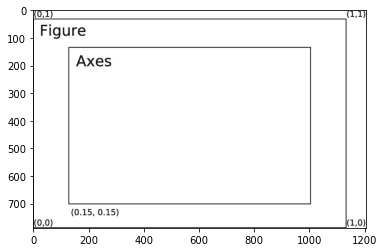
    


* **Axis**:
represents a number line, and is used to determine the graph limits.
* **Axes**:
represent what we construct as plots.
* **Artist**:
refers to everything that you can see on your figure
* **Figure**:
refers to the entire figure you are working on.

https://matplotlib.org/3.2.1/gallery/style_sheets/style_sheets_reference.html


```python
plt.style.use('ggplot')
```


```python
import numpy as np

%matplotlib inline

import math

x = np.arange(0, math.pi*2, 0.05)
y = np.sin(x)
plt.plot(x,y)
```


    [<matplotlib.lines.Line2D at 0x7fdb814db350>]


    
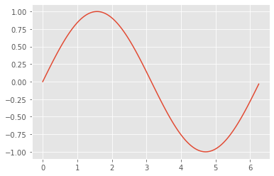
    


```python
x = np.linspace(0, 20)
#print(len(x))

y = np.exp(x)

title = 'Exponential function'

plt.figure(figsize=(6,5))
plt.plot(x, y)

plt.xlabel('x')
plt.ylabel('Exp')
plt.title(title, fontsize=16)
```


    Text(0.5, 1.0, 'Exponential function')


    
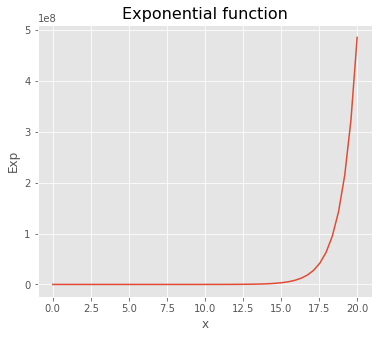
    


```python
coefs = [-2, -1, 0, 1, 2]

f, (ax1, ax2, ax3) = plt.subplots(1, 3, sharey=True, figsize=(18,6))

x = np.linspace(-2, 2, 30)

for idx, val in enumerate([ax1, ax2, ax3]):
    for v in coefs:
        a, b, c = 1, 0, 0 
        
        if idx == 0:
            a=v
        elif idx == 1:
            b=v
        else:
            c=v
        
        y = a * (x**2) + (b * x) + c
        
        val.plot(x, y, label=str(coefs[v])+' coeficient')
        
        val.axhline(y=0, color='k')
        val.axvline(x=0, color='k')
        val.grid()
        val.legend(loc='lower left')
        
plt.show()
```


    
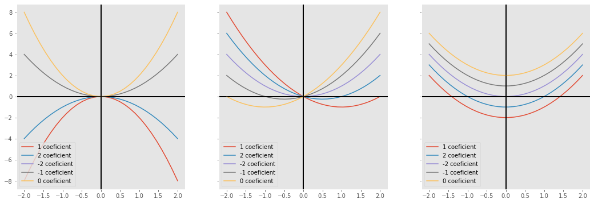
    


```python
x = np.linspace(0, 15)

plt.plot(x, x)
plt.plot(x, 2*x+2, '--')
plt.plot(x, 3*x+6, '*')
```


    [<matplotlib.lines.Line2D at 0x7fdb81cba050>]


    
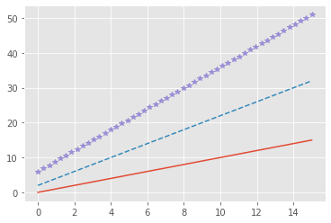
    


```python
plt.plot(x, x, linestyle = 'dashed')
plt.plot(x, 2*x+2, linestyle = 'solid')
plt.plot(x, 3*x+6, linestyle = 'dotted')
```


    [<matplotlib.lines.Line2D at 0x7fdb81e13f90>]


    
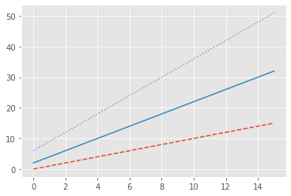
    


```python
plt.plot(x, x, linestyle = 'dashed', color = 'b')
plt.plot(x, 2*x+2, linestyle = 'solid', color = '#FF22DD') #RGB -> #FFFFFF. 0 -> 255
plt.plot(x, 3*x+6, linestyle = 'dotted', color = (1.0, 0.8, 0.2)) #RGB -> (1.0, 1.0, 1.0) 0.0 -> 1.0
```


    [<matplotlib.lines.Line2D at 0x7fdb81f6b090>]


    
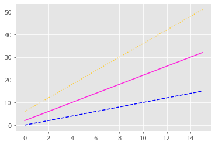
    


```python
plt.plot(x, np.sin(x))
plt.axis([10, 0, 1.0, -1.0]) #[xmin, xmax, ymin, ymax]
```


    (10.0, 0.0, 1.0, -1.0)


    
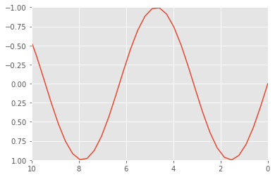
    


```python
plt.plot(x, np.sin(x))
plt.axis([0, 10, -2.0, 2.0])
```


    (0.0, 10.0, -2.0, 2.0)


    
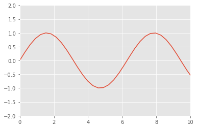
    


## Labeling photos


```python
plt.title('title')
plt.xlabel('x-axis')
plt.ylabel('y-axis')
```


    Text(0, 0.5, 'y-axis')


    
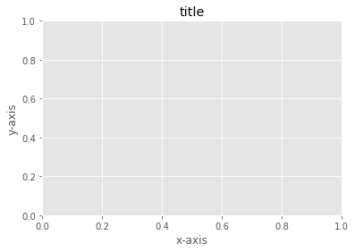
    


```python
x = np.linspace(0, 10, 1000)

plt.plot(x, np.cos(x))
plt.axis([0, 10, -1.0, 1.0])

plt.title('Cosine')
plt.xlabel('x')
plt.ylabel('cos(x)')
```


    Text(0, 0.5, 'cos(x)')


    
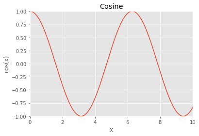
    


```python
plt.plot(x, np.cos(x), linestyle='dashed', label='cos(x)')
plt.plot(x, np.sin(x), linestyle='solid', label='sin(x)', color='green')

plt.axis([0, 10, -1.0, 1.0])
plt.legend()
```


    <matplotlib.legend.Legend at 0x7fdb8210bad0>


    
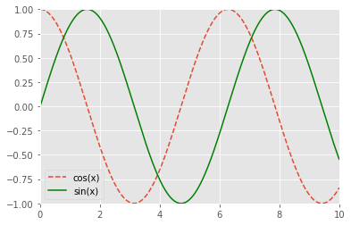
    


### Basic Matplotlib functions


```python
from sklearn.datasets import load_iris
iris = load_iris()
features = iris.data.T

plt.scatter(features[2], features[3], alpha=0.2, s=100, c=iris.target, cmap='viridis')
```


    <matplotlib.collections.PathCollection at 0x7fdb7e71e850>


    
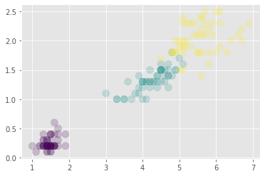
    


#### https://matplotlib.org/stable/tutorials/colors/colormaps.html

### Bar plot


```python
fig = plt.figure()
ax = fig.add_axes([0,0,1,1])

langs = ['C', 'C++', 'Java', 'Python' ,'PHP']
students = [25, 46, 32, 12, 19]

ax.bar(langs, students, color='b', width=0.15)
plt.show()
```


    
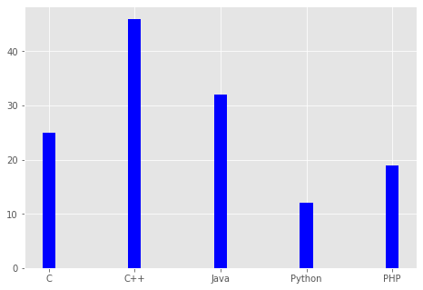
    


```python
fig = plt.figure()
ax = fig.add_axes([0,0,1,1])

langs = ['C', 'C++', 'Java', 'Python' ,'PHP']
boys = [25, 46, 32, 12, 19]
girls = [28, 15, 42, 36, 37]

ax.bar(langs, boys, color='b', width=0.15)
ax.bar(langs, girls, color='r', width=0.15, bottom=boys)

plt.show()
```


    
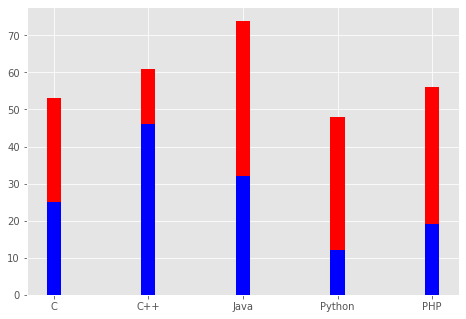
    


```python
data = [[25, 46, 32, 12, 19],[28, 15, 42, 36, 37]]

x = np.arange(5)
fig = plt.figure()
ax = fig.add_axes([0,0,1,1])

ax.bar(x+0.0, data[0], color='b', width=0.15)
ax.bar(x+0.2, data[1], color='r', width=0.15)
plt.show()
```


    
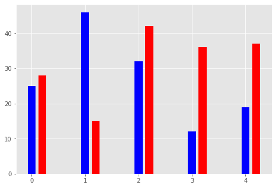
    


### Pie Chart


```python
fig = plt.figure()
ax = fig.add_axes([0,0,1,1])

langs = ['C', 'C++', 'Java', 'Python' ,'PHP']
students = [25, 46, 32, 12, 19]

ax.pie(students, labels=langs, autopct='%1.2f%%')
plt.show()
```


    
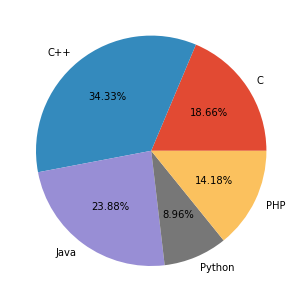
    


### Histograms


```python
#Normal distribution
x=np.random.randn(1000)

plt.hist(x, bins=20)
plt.show()
```


    
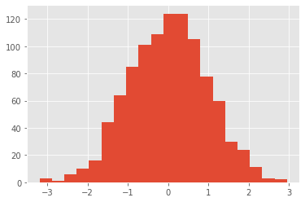
    


### Boxplot


```python
plt.boxplot(x)
plt.show()
```


    
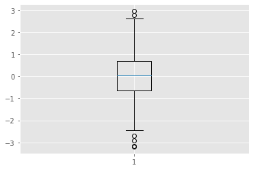
    


## Multiple subplots


```python
t = np.arange(0, 5, 0.1)

y1 = np.sin(2*np.pi*t)
y2 = np.sin(2*np.pi*t)

plt.subplot(211)
plt.plot(t, y1, 'b-.')
plt.subplot(212)
plt.plot(t, y2, 'r--')
```


    [<matplotlib.lines.Line2D at 0x7fdb80c78dd0>]


    
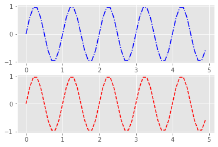
    


```python
t = np.arange(0, 1, 0.1)

y1 = np.sin(2*np.pi*t)
y2 = np.cos(2*np.pi*t)
y3 = t

plt.subplot(131)
plt.plot(t, y1, 'b-.')
plt.subplot(132)
plt.plot(t, y2, 'r--')
plt.subplot(133)
plt.plot(t, y3, 'g*')
```


    [<matplotlib.lines.Line2D at 0x7fdb80e32c50>]


    
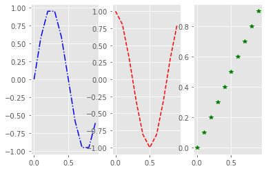
    


```python
fig, a = plt.subplots(2,2) #subplots(rows, cols)

x = np.arange(0,10)
a[0,0].plot(x, x*x)
a[0,0].set_title('Squared')

a[0,1].plot(x, np.sqrt(x))
a[0,1].set_title('Square root')

a[1,0].plot(x, np.exp(x))
a[1,0].set_title('Exponential')

a[1,1].plot(x, np.log10(x))
a[1,1].set_title('Log10')

plt.show()
```


    
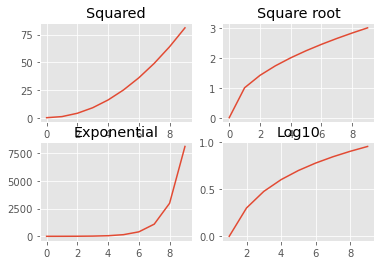
    


```python
fig.savefig('newFigure.png')
```


```python
img = mpimg.imread('newFigure.png')
imgplot = plt.imshow(img)
imgplot
```


    <matplotlib.image.AxesImage at 0x7fdb80a38450>


    
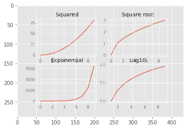
    


```python
# Pillow
from PIL import Image

image = Image.open('newFigure.png')
image.show()
```


```python
#Recommended Images library
#OpenCV -> cv2
```

#### My Project Samples


```python
img = mpimg.imread('sarga.png')

plt.imshow(img)
```


    <matplotlib.image.AxesImage at 0x7fdb7e7bd8d0>


    
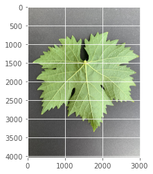
    


```python
import warnings
warnings.simplefilter(action='ignore')

import numpy as np

inFile = open('VisualRolledFixedX.txt', 'r')

inX = []
inY = []
   
for x in inFile:
    inX.append(np.array([float(ts) for ts in x.split()[:-1]]))
    inY.append(int(float(x.split()[-1:][0])))

inX = np.array(inX)
inY = np.array(inY)

from sklearn.model_selection import train_test_split

xTrain, xTest, yTrain, yTest = train_test_split(inX, inY, test_size=0.5, stratify=inY)

x_train, x_val, y_train, y_val = train_test_split(xTrain, yTrain, test_size=0.50)


# Mapping table for classes
lNames = {1:'Cabernet Franc', 2:'Kekfrankos', 3:'Sargamuskotaly',
          4:'Szurkebarat', 5:'Tramini'} 
    
import matplotlib.pyplot as plt
%matplotlib inline

fig = plt.figure()
ax = fig.add_axes([0,0,1,1])

import collections

count = collections.Counter(inY).values()
ax.bar(lNames.values(), count, color='b')
plt.show()
```


    
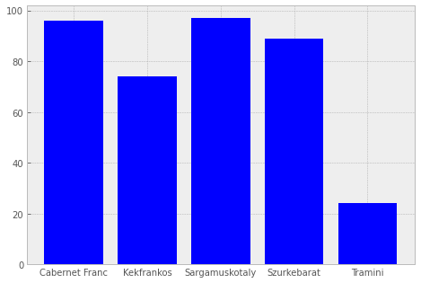
    


```python
plt.style.use('bmh')
%matplotlib inline
plt.figure(figsize=(15,15))
colors = ['#FF0000','#FFFF00','#00FF00','#00FFFF','#0000FF',
          '#7F7F7F','#000000','#FF00FF','#1E90FF','#FF00FF',
            '#FF00FF','#FF00FF','#1E90FF','#1E90FF','#1E90FF']

for i, r in enumerate(range(8)):
    plt.subplot(8,2,i+1)
    plt.plot(xTrain[r], label=lNames[yTrain[r]], color=colors[i], linewidth=2)
    plt.xlabel('Leaf Series')
    plt.legend(loc='lower left')
    plt.tight_layout()
```


    
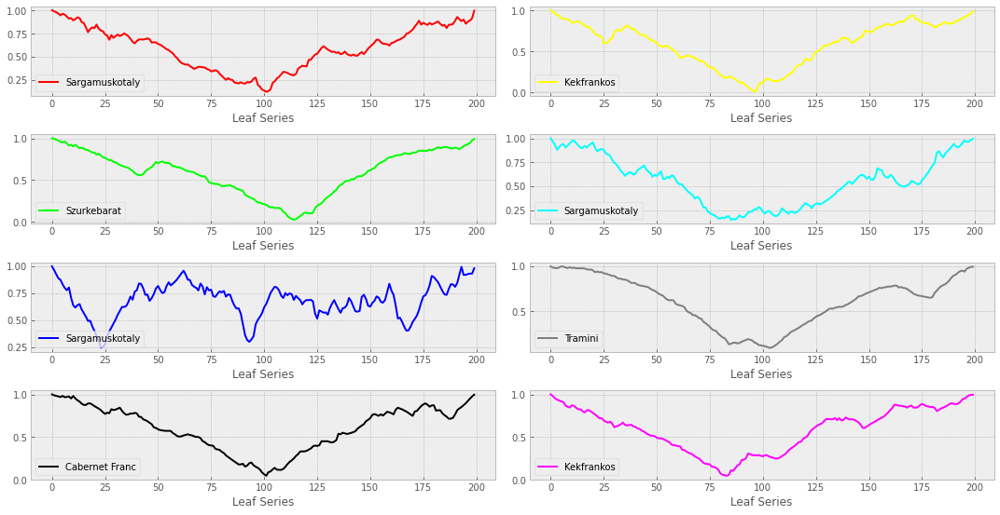
    
