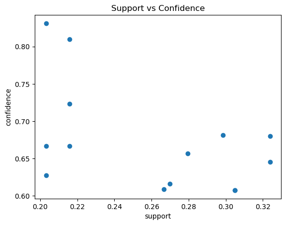
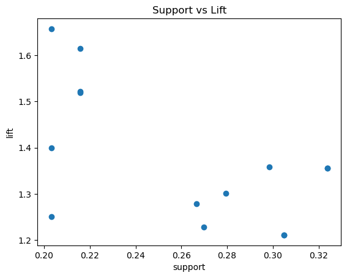
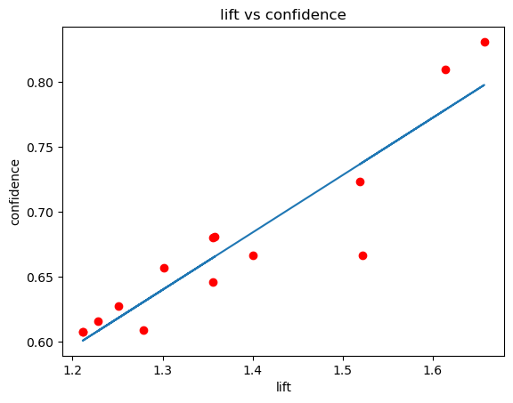

# Frequent Pattern Mining


```python
import warnings
warnings.simplefilter(action='ignore')
```


```python
import numpy as np
import pandas as pd
#mlxtend

df = pd.read_csv('frequent.csv', sep=',')
#df = pd.read_csv('Untitled.csv', sep=',') #Group A
df
```


<div>
<table border="1" class="dataframe">
  <thead>
    <tr style="text-align: right;">
      <th></th>
      <th>0</th>
      <th>1</th>
      <th>2</th>
      <th>3</th>
      <th>4</th>
      <th>5</th>
      <th>6</th>
    </tr>
  </thead>
  <tbody>
    <tr>
      <th>0</th>
      <td>Bread</td>
      <td>Wine</td>
      <td>Eggs</td>
      <td>Meat</td>
      <td>Cheese</td>
      <td>Pencil</td>
      <td>Diaper</td>
    </tr>
    <tr>
      <th>1</th>
      <td>Bread</td>
      <td>Cheese</td>
      <td>Meat</td>
      <td>Diaper</td>
      <td>Wine</td>
      <td>Milk</td>
      <td>Pencil</td>
    </tr>
    <tr>
      <th>2</th>
      <td>Cheese</td>
      <td>Meat</td>
      <td>Eggs</td>
      <td>Milk</td>
      <td>Wine</td>
      <td>NaN</td>
      <td>NaN</td>
    </tr>
    <tr>
      <th>3</th>
      <td>Cheese</td>
      <td>Meat</td>
      <td>Eggs</td>
      <td>Milk</td>
      <td>Wine</td>
      <td>NaN</td>
      <td>NaN</td>
    </tr>
    <tr>
      <th>4</th>
      <td>Meat</td>
      <td>Pencil</td>
      <td>Wine</td>
      <td>NaN</td>
      <td>NaN</td>
      <td>NaN</td>
      <td>NaN</td>
    </tr>
    <tr>
      <th>...</th>
      <td>...</td>
      <td>...</td>
      <td>...</td>
      <td>...</td>
      <td>...</td>
      <td>...</td>
      <td>...</td>
    </tr>
    <tr>
      <th>310</th>
      <td>Bread</td>
      <td>Eggs</td>
      <td>Cheese</td>
      <td>NaN</td>
      <td>NaN</td>
      <td>NaN</td>
      <td>NaN</td>
    </tr>
    <tr>
      <th>311</th>
      <td>Meat</td>
      <td>Milk</td>
      <td>Pencil</td>
      <td>NaN</td>
      <td>NaN</td>
      <td>NaN</td>
      <td>NaN</td>
    </tr>
    <tr>
      <th>312</th>
      <td>Bread</td>
      <td>Cheese</td>
      <td>Eggs</td>
      <td>Meat</td>
      <td>Pencil</td>
      <td>Diaper</td>
      <td>Wine</td>
    </tr>
    <tr>
      <th>313</th>
      <td>Meat</td>
      <td>Cheese</td>
      <td>NaN</td>
      <td>NaN</td>
      <td>NaN</td>
      <td>NaN</td>
      <td>NaN</td>
    </tr>
    <tr>
      <th>314</th>
      <td>Eggs</td>
      <td>Wine</td>
      <td>Bagel</td>
      <td>Bread</td>
      <td>Meat</td>
      <td>NaN</td>
      <td>NaN</td>
    </tr>
  </tbody>
</table>
<p>315 rows × 7 columns</p>
</div>


```python
items = set()
for c in df:
    items.update(df[c].unique())
    
print(items)
```

    {'Meat', 'Diaper', 'Eggs', 'Cheese', nan, 'Milk', 'Wine', 'Bread', 'Pencil', 'Bagel'}


```python
items = [x for x in items if not pd.isnull(x)]
print(items)
```

    ['Meat', 'Diaper', 'Eggs', 'Cheese', 'Milk', 'Wine', 'Bread', 'Pencil', 'Bagel']


```python
pd.get_dummies(df)
```


<div>
<table border="1" class="dataframe">
  <thead>
    <tr style="text-align: right;">
      <th></th>
      <th>0_Bagel</th>
      <th>0_Bread</th>
      <th>0_Cheese</th>
      <th>0_Diaper</th>
      <th>0_Eggs</th>
      <th>0_Meat</th>
      <th>0_Milk</th>
      <th>0_Pencil</th>
      <th>0_Wine</th>
      <th>1_Bagel</th>
      <th>...</th>
      <th>5_Wine</th>
      <th>6_Bagel</th>
      <th>6_Bread</th>
      <th>6_Cheese</th>
      <th>6_Diaper</th>
      <th>6_Eggs</th>
      <th>6_Meat</th>
      <th>6_Milk</th>
      <th>6_Pencil</th>
      <th>6_Wine</th>
    </tr>
  </thead>
  <tbody>
    <tr>
      <th>0</th>
      <td>0</td>
      <td>1</td>
      <td>0</td>
      <td>0</td>
      <td>0</td>
      <td>0</td>
      <td>0</td>
      <td>0</td>
      <td>0</td>
      <td>0</td>
      <td>...</td>
      <td>0</td>
      <td>0</td>
      <td>0</td>
      <td>0</td>
      <td>1</td>
      <td>0</td>
      <td>0</td>
      <td>0</td>
      <td>0</td>
      <td>0</td>
    </tr>
    <tr>
      <th>1</th>
      <td>0</td>
      <td>1</td>
      <td>0</td>
      <td>0</td>
      <td>0</td>
      <td>0</td>
      <td>0</td>
      <td>0</td>
      <td>0</td>
      <td>0</td>
      <td>...</td>
      <td>0</td>
      <td>0</td>
      <td>0</td>
      <td>0</td>
      <td>0</td>
      <td>0</td>
      <td>0</td>
      <td>0</td>
      <td>1</td>
      <td>0</td>
    </tr>
    <tr>
      <th>2</th>
      <td>0</td>
      <td>0</td>
      <td>1</td>
      <td>0</td>
      <td>0</td>
      <td>0</td>
      <td>0</td>
      <td>0</td>
      <td>0</td>
      <td>0</td>
      <td>...</td>
      <td>0</td>
      <td>0</td>
      <td>0</td>
      <td>0</td>
      <td>0</td>
      <td>0</td>
      <td>0</td>
      <td>0</td>
      <td>0</td>
      <td>0</td>
    </tr>
    <tr>
      <th>3</th>
      <td>0</td>
      <td>0</td>
      <td>1</td>
      <td>0</td>
      <td>0</td>
      <td>0</td>
      <td>0</td>
      <td>0</td>
      <td>0</td>
      <td>0</td>
      <td>...</td>
      <td>0</td>
      <td>0</td>
      <td>0</td>
      <td>0</td>
      <td>0</td>
      <td>0</td>
      <td>0</td>
      <td>0</td>
      <td>0</td>
      <td>0</td>
    </tr>
    <tr>
      <th>4</th>
      <td>0</td>
      <td>0</td>
      <td>0</td>
      <td>0</td>
      <td>0</td>
      <td>1</td>
      <td>0</td>
      <td>0</td>
      <td>0</td>
      <td>0</td>
      <td>...</td>
      <td>0</td>
      <td>0</td>
      <td>0</td>
      <td>0</td>
      <td>0</td>
      <td>0</td>
      <td>0</td>
      <td>0</td>
      <td>0</td>
      <td>0</td>
    </tr>
    <tr>
      <th>...</th>
      <td>...</td>
      <td>...</td>
      <td>...</td>
      <td>...</td>
      <td>...</td>
      <td>...</td>
      <td>...</td>
      <td>...</td>
      <td>...</td>
      <td>...</td>
      <td>...</td>
      <td>...</td>
      <td>...</td>
      <td>...</td>
      <td>...</td>
      <td>...</td>
      <td>...</td>
      <td>...</td>
      <td>...</td>
      <td>...</td>
      <td>...</td>
    </tr>
    <tr>
      <th>310</th>
      <td>0</td>
      <td>1</td>
      <td>0</td>
      <td>0</td>
      <td>0</td>
      <td>0</td>
      <td>0</td>
      <td>0</td>
      <td>0</td>
      <td>0</td>
      <td>...</td>
      <td>0</td>
      <td>0</td>
      <td>0</td>
      <td>0</td>
      <td>0</td>
      <td>0</td>
      <td>0</td>
      <td>0</td>
      <td>0</td>
      <td>0</td>
    </tr>
    <tr>
      <th>311</th>
      <td>0</td>
      <td>0</td>
      <td>0</td>
      <td>0</td>
      <td>0</td>
      <td>1</td>
      <td>0</td>
      <td>0</td>
      <td>0</td>
      <td>0</td>
      <td>...</td>
      <td>0</td>
      <td>0</td>
      <td>0</td>
      <td>0</td>
      <td>0</td>
      <td>0</td>
      <td>0</td>
      <td>0</td>
      <td>0</td>
      <td>0</td>
    </tr>
    <tr>
      <th>312</th>
      <td>0</td>
      <td>1</td>
      <td>0</td>
      <td>0</td>
      <td>0</td>
      <td>0</td>
      <td>0</td>
      <td>0</td>
      <td>0</td>
      <td>0</td>
      <td>...</td>
      <td>0</td>
      <td>0</td>
      <td>0</td>
      <td>0</td>
      <td>0</td>
      <td>0</td>
      <td>0</td>
      <td>0</td>
      <td>0</td>
      <td>1</td>
    </tr>
    <tr>
      <th>313</th>
      <td>0</td>
      <td>0</td>
      <td>0</td>
      <td>0</td>
      <td>0</td>
      <td>1</td>
      <td>0</td>
      <td>0</td>
      <td>0</td>
      <td>0</td>
      <td>...</td>
      <td>0</td>
      <td>0</td>
      <td>0</td>
      <td>0</td>
      <td>0</td>
      <td>0</td>
      <td>0</td>
      <td>0</td>
      <td>0</td>
      <td>0</td>
    </tr>
    <tr>
      <th>314</th>
      <td>0</td>
      <td>0</td>
      <td>0</td>
      <td>0</td>
      <td>1</td>
      <td>0</td>
      <td>0</td>
      <td>0</td>
      <td>0</td>
      <td>0</td>
      <td>...</td>
      <td>0</td>
      <td>0</td>
      <td>0</td>
      <td>0</td>
      <td>0</td>
      <td>0</td>
      <td>0</td>
      <td>0</td>
      <td>0</td>
      <td>0</td>
    </tr>
  </tbody>
</table>
<p>315 rows × 63 columns</p>
</div>


```python
from sklearn.preprocessing import OneHotEncoder

encoder = OneHotEncoder(sparse=False)
x = encoder.fit_transform(df)
pd.DataFrame(x)
```


<div>
<table border="1" class="dataframe">
  <thead>
    <tr style="text-align: right;">
      <th></th>
      <th>0</th>
      <th>1</th>
      <th>2</th>
      <th>3</th>
      <th>4</th>
      <th>5</th>
      <th>6</th>
      <th>7</th>
      <th>8</th>
      <th>9</th>
      <th>...</th>
      <th>59</th>
      <th>60</th>
      <th>61</th>
      <th>62</th>
      <th>63</th>
      <th>64</th>
      <th>65</th>
      <th>66</th>
      <th>67</th>
      <th>68</th>
    </tr>
  </thead>
  <tbody>
    <tr>
      <th>0</th>
      <td>0.0</td>
      <td>1.0</td>
      <td>0.0</td>
      <td>0.0</td>
      <td>0.0</td>
      <td>0.0</td>
      <td>0.0</td>
      <td>0.0</td>
      <td>0.0</td>
      <td>0.0</td>
      <td>...</td>
      <td>0.0</td>
      <td>0.0</td>
      <td>0.0</td>
      <td>1.0</td>
      <td>0.0</td>
      <td>0.0</td>
      <td>0.0</td>
      <td>0.0</td>
      <td>0.0</td>
      <td>0.0</td>
    </tr>
    <tr>
      <th>1</th>
      <td>0.0</td>
      <td>1.0</td>
      <td>0.0</td>
      <td>0.0</td>
      <td>0.0</td>
      <td>0.0</td>
      <td>0.0</td>
      <td>0.0</td>
      <td>0.0</td>
      <td>0.0</td>
      <td>...</td>
      <td>0.0</td>
      <td>0.0</td>
      <td>0.0</td>
      <td>0.0</td>
      <td>0.0</td>
      <td>0.0</td>
      <td>0.0</td>
      <td>1.0</td>
      <td>0.0</td>
      <td>0.0</td>
    </tr>
    <tr>
      <th>2</th>
      <td>0.0</td>
      <td>0.0</td>
      <td>1.0</td>
      <td>0.0</td>
      <td>0.0</td>
      <td>0.0</td>
      <td>0.0</td>
      <td>0.0</td>
      <td>0.0</td>
      <td>0.0</td>
      <td>...</td>
      <td>0.0</td>
      <td>0.0</td>
      <td>0.0</td>
      <td>0.0</td>
      <td>0.0</td>
      <td>0.0</td>
      <td>0.0</td>
      <td>0.0</td>
      <td>0.0</td>
      <td>1.0</td>
    </tr>
    <tr>
      <th>3</th>
      <td>0.0</td>
      <td>0.0</td>
      <td>1.0</td>
      <td>0.0</td>
      <td>0.0</td>
      <td>0.0</td>
      <td>0.0</td>
      <td>0.0</td>
      <td>0.0</td>
      <td>0.0</td>
      <td>...</td>
      <td>0.0</td>
      <td>0.0</td>
      <td>0.0</td>
      <td>0.0</td>
      <td>0.0</td>
      <td>0.0</td>
      <td>0.0</td>
      <td>0.0</td>
      <td>0.0</td>
      <td>1.0</td>
    </tr>
    <tr>
      <th>4</th>
      <td>0.0</td>
      <td>0.0</td>
      <td>0.0</td>
      <td>0.0</td>
      <td>0.0</td>
      <td>1.0</td>
      <td>0.0</td>
      <td>0.0</td>
      <td>0.0</td>
      <td>0.0</td>
      <td>...</td>
      <td>0.0</td>
      <td>0.0</td>
      <td>0.0</td>
      <td>0.0</td>
      <td>0.0</td>
      <td>0.0</td>
      <td>0.0</td>
      <td>0.0</td>
      <td>0.0</td>
      <td>1.0</td>
    </tr>
    <tr>
      <th>...</th>
      <td>...</td>
      <td>...</td>
      <td>...</td>
      <td>...</td>
      <td>...</td>
      <td>...</td>
      <td>...</td>
      <td>...</td>
      <td>...</td>
      <td>...</td>
      <td>...</td>
      <td>...</td>
      <td>...</td>
      <td>...</td>
      <td>...</td>
      <td>...</td>
      <td>...</td>
      <td>...</td>
      <td>...</td>
      <td>...</td>
      <td>...</td>
    </tr>
    <tr>
      <th>310</th>
      <td>0.0</td>
      <td>1.0</td>
      <td>0.0</td>
      <td>0.0</td>
      <td>0.0</td>
      <td>0.0</td>
      <td>0.0</td>
      <td>0.0</td>
      <td>0.0</td>
      <td>0.0</td>
      <td>...</td>
      <td>0.0</td>
      <td>0.0</td>
      <td>0.0</td>
      <td>0.0</td>
      <td>0.0</td>
      <td>0.0</td>
      <td>0.0</td>
      <td>0.0</td>
      <td>0.0</td>
      <td>1.0</td>
    </tr>
    <tr>
      <th>311</th>
      <td>0.0</td>
      <td>0.0</td>
      <td>0.0</td>
      <td>0.0</td>
      <td>0.0</td>
      <td>1.0</td>
      <td>0.0</td>
      <td>0.0</td>
      <td>0.0</td>
      <td>0.0</td>
      <td>...</td>
      <td>0.0</td>
      <td>0.0</td>
      <td>0.0</td>
      <td>0.0</td>
      <td>0.0</td>
      <td>0.0</td>
      <td>0.0</td>
      <td>0.0</td>
      <td>0.0</td>
      <td>1.0</td>
    </tr>
    <tr>
      <th>312</th>
      <td>0.0</td>
      <td>1.0</td>
      <td>0.0</td>
      <td>0.0</td>
      <td>0.0</td>
      <td>0.0</td>
      <td>0.0</td>
      <td>0.0</td>
      <td>0.0</td>
      <td>0.0</td>
      <td>...</td>
      <td>0.0</td>
      <td>0.0</td>
      <td>0.0</td>
      <td>0.0</td>
      <td>0.0</td>
      <td>0.0</td>
      <td>0.0</td>
      <td>0.0</td>
      <td>1.0</td>
      <td>0.0</td>
    </tr>
    <tr>
      <th>313</th>
      <td>0.0</td>
      <td>0.0</td>
      <td>0.0</td>
      <td>0.0</td>
      <td>0.0</td>
      <td>1.0</td>
      <td>0.0</td>
      <td>0.0</td>
      <td>0.0</td>
      <td>0.0</td>
      <td>...</td>
      <td>0.0</td>
      <td>0.0</td>
      <td>0.0</td>
      <td>0.0</td>
      <td>0.0</td>
      <td>0.0</td>
      <td>0.0</td>
      <td>0.0</td>
      <td>0.0</td>
      <td>1.0</td>
    </tr>
    <tr>
      <th>314</th>
      <td>0.0</td>
      <td>0.0</td>
      <td>0.0</td>
      <td>0.0</td>
      <td>1.0</td>
      <td>0.0</td>
      <td>0.0</td>
      <td>0.0</td>
      <td>0.0</td>
      <td>0.0</td>
      <td>...</td>
      <td>0.0</td>
      <td>0.0</td>
      <td>0.0</td>
      <td>0.0</td>
      <td>0.0</td>
      <td>0.0</td>
      <td>0.0</td>
      <td>0.0</td>
      <td>0.0</td>
      <td>1.0</td>
    </tr>
  </tbody>
</table>
<p>315 rows × 69 columns</p>
</div>


```python
columnNames = encoder.get_feature_names_out()
columnNames
```


    array(['0_Bagel', '0_Bread', '0_Cheese', '0_Diaper', '0_Eggs', '0_Meat',
           '0_Milk', '0_Pencil', '0_Wine', '1_Bagel', '1_Bread', '1_Cheese',
           '1_Diaper', '1_Eggs', '1_Meat', '1_Milk', '1_Pencil', '1_Wine',
           '1_nan', '2_Bagel', '2_Bread', '2_Cheese', '2_Diaper', '2_Eggs',
           '2_Meat', '2_Milk', '2_Pencil', '2_Wine', '2_nan', '3_Bagel',
           '3_Bread', '3_Cheese', '3_Diaper', '3_Eggs', '3_Meat', '3_Milk',
           '3_Pencil', '3_Wine', '3_nan', '4_Bagel', '4_Bread', '4_Cheese',
           '4_Diaper', '4_Eggs', '4_Meat', '4_Milk', '4_Pencil', '4_Wine',
           '4_nan', '5_Bagel', '5_Bread', '5_Cheese', '5_Diaper', '5_Eggs',
           '5_Meat', '5_Milk', '5_Pencil', '5_Wine', '5_nan', '6_Bagel',
           '6_Bread', '6_Cheese', '6_Diaper', '6_Eggs', '6_Meat', '6_Milk',
           '6_Pencil', '6_Wine', '6_nan'], dtype=object)


```python
itemset = pd.DataFrame(x, columns=columnNames)

itemset
```


<div>
<table border="1" class="dataframe">
  <thead>
    <tr style="text-align: right;">
      <th></th>
      <th>0_Bagel</th>
      <th>0_Bread</th>
      <th>0_Cheese</th>
      <th>0_Diaper</th>
      <th>0_Eggs</th>
      <th>0_Meat</th>
      <th>0_Milk</th>
      <th>0_Pencil</th>
      <th>0_Wine</th>
      <th>1_Bagel</th>
      <th>...</th>
      <th>6_Bagel</th>
      <th>6_Bread</th>
      <th>6_Cheese</th>
      <th>6_Diaper</th>
      <th>6_Eggs</th>
      <th>6_Meat</th>
      <th>6_Milk</th>
      <th>6_Pencil</th>
      <th>6_Wine</th>
      <th>6_nan</th>
    </tr>
  </thead>
  <tbody>
    <tr>
      <th>0</th>
      <td>0.0</td>
      <td>1.0</td>
      <td>0.0</td>
      <td>0.0</td>
      <td>0.0</td>
      <td>0.0</td>
      <td>0.0</td>
      <td>0.0</td>
      <td>0.0</td>
      <td>0.0</td>
      <td>...</td>
      <td>0.0</td>
      <td>0.0</td>
      <td>0.0</td>
      <td>1.0</td>
      <td>0.0</td>
      <td>0.0</td>
      <td>0.0</td>
      <td>0.0</td>
      <td>0.0</td>
      <td>0.0</td>
    </tr>
    <tr>
      <th>1</th>
      <td>0.0</td>
      <td>1.0</td>
      <td>0.0</td>
      <td>0.0</td>
      <td>0.0</td>
      <td>0.0</td>
      <td>0.0</td>
      <td>0.0</td>
      <td>0.0</td>
      <td>0.0</td>
      <td>...</td>
      <td>0.0</td>
      <td>0.0</td>
      <td>0.0</td>
      <td>0.0</td>
      <td>0.0</td>
      <td>0.0</td>
      <td>0.0</td>
      <td>1.0</td>
      <td>0.0</td>
      <td>0.0</td>
    </tr>
    <tr>
      <th>2</th>
      <td>0.0</td>
      <td>0.0</td>
      <td>1.0</td>
      <td>0.0</td>
      <td>0.0</td>
      <td>0.0</td>
      <td>0.0</td>
      <td>0.0</td>
      <td>0.0</td>
      <td>0.0</td>
      <td>...</td>
      <td>0.0</td>
      <td>0.0</td>
      <td>0.0</td>
      <td>0.0</td>
      <td>0.0</td>
      <td>0.0</td>
      <td>0.0</td>
      <td>0.0</td>
      <td>0.0</td>
      <td>1.0</td>
    </tr>
    <tr>
      <th>3</th>
      <td>0.0</td>
      <td>0.0</td>
      <td>1.0</td>
      <td>0.0</td>
      <td>0.0</td>
      <td>0.0</td>
      <td>0.0</td>
      <td>0.0</td>
      <td>0.0</td>
      <td>0.0</td>
      <td>...</td>
      <td>0.0</td>
      <td>0.0</td>
      <td>0.0</td>
      <td>0.0</td>
      <td>0.0</td>
      <td>0.0</td>
      <td>0.0</td>
      <td>0.0</td>
      <td>0.0</td>
      <td>1.0</td>
    </tr>
    <tr>
      <th>4</th>
      <td>0.0</td>
      <td>0.0</td>
      <td>0.0</td>
      <td>0.0</td>
      <td>0.0</td>
      <td>1.0</td>
      <td>0.0</td>
      <td>0.0</td>
      <td>0.0</td>
      <td>0.0</td>
      <td>...</td>
      <td>0.0</td>
      <td>0.0</td>
      <td>0.0</td>
      <td>0.0</td>
      <td>0.0</td>
      <td>0.0</td>
      <td>0.0</td>
      <td>0.0</td>
      <td>0.0</td>
      <td>1.0</td>
    </tr>
    <tr>
      <th>...</th>
      <td>...</td>
      <td>...</td>
      <td>...</td>
      <td>...</td>
      <td>...</td>
      <td>...</td>
      <td>...</td>
      <td>...</td>
      <td>...</td>
      <td>...</td>
      <td>...</td>
      <td>...</td>
      <td>...</td>
      <td>...</td>
      <td>...</td>
      <td>...</td>
      <td>...</td>
      <td>...</td>
      <td>...</td>
      <td>...</td>
      <td>...</td>
    </tr>
    <tr>
      <th>310</th>
      <td>0.0</td>
      <td>1.0</td>
      <td>0.0</td>
      <td>0.0</td>
      <td>0.0</td>
      <td>0.0</td>
      <td>0.0</td>
      <td>0.0</td>
      <td>0.0</td>
      <td>0.0</td>
      <td>...</td>
      <td>0.0</td>
      <td>0.0</td>
      <td>0.0</td>
      <td>0.0</td>
      <td>0.0</td>
      <td>0.0</td>
      <td>0.0</td>
      <td>0.0</td>
      <td>0.0</td>
      <td>1.0</td>
    </tr>
    <tr>
      <th>311</th>
      <td>0.0</td>
      <td>0.0</td>
      <td>0.0</td>
      <td>0.0</td>
      <td>0.0</td>
      <td>1.0</td>
      <td>0.0</td>
      <td>0.0</td>
      <td>0.0</td>
      <td>0.0</td>
      <td>...</td>
      <td>0.0</td>
      <td>0.0</td>
      <td>0.0</td>
      <td>0.0</td>
      <td>0.0</td>
      <td>0.0</td>
      <td>0.0</td>
      <td>0.0</td>
      <td>0.0</td>
      <td>1.0</td>
    </tr>
    <tr>
      <th>312</th>
      <td>0.0</td>
      <td>1.0</td>
      <td>0.0</td>
      <td>0.0</td>
      <td>0.0</td>
      <td>0.0</td>
      <td>0.0</td>
      <td>0.0</td>
      <td>0.0</td>
      <td>0.0</td>
      <td>...</td>
      <td>0.0</td>
      <td>0.0</td>
      <td>0.0</td>
      <td>0.0</td>
      <td>0.0</td>
      <td>0.0</td>
      <td>0.0</td>
      <td>0.0</td>
      <td>1.0</td>
      <td>0.0</td>
    </tr>
    <tr>
      <th>313</th>
      <td>0.0</td>
      <td>0.0</td>
      <td>0.0</td>
      <td>0.0</td>
      <td>0.0</td>
      <td>1.0</td>
      <td>0.0</td>
      <td>0.0</td>
      <td>0.0</td>
      <td>0.0</td>
      <td>...</td>
      <td>0.0</td>
      <td>0.0</td>
      <td>0.0</td>
      <td>0.0</td>
      <td>0.0</td>
      <td>0.0</td>
      <td>0.0</td>
      <td>0.0</td>
      <td>0.0</td>
      <td>1.0</td>
    </tr>
    <tr>
      <th>314</th>
      <td>0.0</td>
      <td>0.0</td>
      <td>0.0</td>
      <td>0.0</td>
      <td>1.0</td>
      <td>0.0</td>
      <td>0.0</td>
      <td>0.0</td>
      <td>0.0</td>
      <td>0.0</td>
      <td>...</td>
      <td>0.0</td>
      <td>0.0</td>
      <td>0.0</td>
      <td>0.0</td>
      <td>0.0</td>
      <td>0.0</td>
      <td>0.0</td>
      <td>0.0</td>
      <td>0.0</td>
      <td>1.0</td>
    </tr>
  </tbody>
</table>
<p>315 rows × 69 columns</p>
</div>


```python
from mlxtend.frequent_patterns import apriori

freq_items = apriori(itemset, min_support=0.2, use_colnames=True, verbose=1)
freq_items
```

    Processing 5 combinations | Sampling itemset size 5


    /Users/joseluis/anaconda3/lib/python3.11/site-packages/mlxtend/frequent_patterns/fpcommon.py:110: DeprecationWarning: DataFrames with non-bool types result in worse computationalperformance and their support might be discontinued in the future.Please use a DataFrame with bool type
      warnings.warn(


<div>
<table border="1" class="dataframe">
  <thead>
    <tr style="text-align: right;">
      <th></th>
      <th>support</th>
      <th>itemsets</th>
    </tr>
  </thead>
  <tbody>
    <tr>
      <th>0</th>
      <td>0.234921</td>
      <td>(0_Bread)</td>
    </tr>
    <tr>
      <th>1</th>
      <td>0.222222</td>
      <td>(2_nan)</td>
    </tr>
    <tr>
      <th>2</th>
      <td>0.406349</td>
      <td>(3_nan)</td>
    </tr>
    <tr>
      <th>3</th>
      <td>0.577778</td>
      <td>(4_nan)</td>
    </tr>
    <tr>
      <th>4</th>
      <td>0.774603</td>
      <td>(5_nan)</td>
    </tr>
    <tr>
      <th>5</th>
      <td>0.869841</td>
      <td>(6_nan)</td>
    </tr>
    <tr>
      <th>6</th>
      <td>0.206349</td>
      <td>(0_Bread, 6_nan)</td>
    </tr>
    <tr>
      <th>7</th>
      <td>0.222222</td>
      <td>(2_nan, 3_nan)</td>
    </tr>
    <tr>
      <th>8</th>
      <td>0.222222</td>
      <td>(2_nan, 4_nan)</td>
    </tr>
    <tr>
      <th>9</th>
      <td>0.222222</td>
      <td>(2_nan, 5_nan)</td>
    </tr>
    <tr>
      <th>10</th>
      <td>0.222222</td>
      <td>(2_nan, 6_nan)</td>
    </tr>
    <tr>
      <th>11</th>
      <td>0.406349</td>
      <td>(4_nan, 3_nan)</td>
    </tr>
    <tr>
      <th>12</th>
      <td>0.406349</td>
      <td>(5_nan, 3_nan)</td>
    </tr>
    <tr>
      <th>13</th>
      <td>0.406349</td>
      <td>(3_nan, 6_nan)</td>
    </tr>
    <tr>
      <th>14</th>
      <td>0.577778</td>
      <td>(4_nan, 5_nan)</td>
    </tr>
    <tr>
      <th>15</th>
      <td>0.577778</td>
      <td>(4_nan, 6_nan)</td>
    </tr>
    <tr>
      <th>16</th>
      <td>0.774603</td>
      <td>(5_nan, 6_nan)</td>
    </tr>
    <tr>
      <th>17</th>
      <td>0.222222</td>
      <td>(2_nan, 4_nan, 3_nan)</td>
    </tr>
    <tr>
      <th>18</th>
      <td>0.222222</td>
      <td>(2_nan, 5_nan, 3_nan)</td>
    </tr>
    <tr>
      <th>19</th>
      <td>0.222222</td>
      <td>(2_nan, 3_nan, 6_nan)</td>
    </tr>
    <tr>
      <th>20</th>
      <td>0.222222</td>
      <td>(2_nan, 4_nan, 5_nan)</td>
    </tr>
    <tr>
      <th>21</th>
      <td>0.222222</td>
      <td>(2_nan, 4_nan, 6_nan)</td>
    </tr>
    <tr>
      <th>22</th>
      <td>0.222222</td>
      <td>(2_nan, 5_nan, 6_nan)</td>
    </tr>
    <tr>
      <th>23</th>
      <td>0.406349</td>
      <td>(4_nan, 3_nan, 5_nan)</td>
    </tr>
    <tr>
      <th>24</th>
      <td>0.406349</td>
      <td>(4_nan, 3_nan, 6_nan)</td>
    </tr>
    <tr>
      <th>25</th>
      <td>0.406349</td>
      <td>(5_nan, 3_nan, 6_nan)</td>
    </tr>
    <tr>
      <th>26</th>
      <td>0.577778</td>
      <td>(6_nan, 4_nan, 5_nan)</td>
    </tr>
    <tr>
      <th>27</th>
      <td>0.222222</td>
      <td>(2_nan, 4_nan, 3_nan, 5_nan)</td>
    </tr>
    <tr>
      <th>28</th>
      <td>0.222222</td>
      <td>(2_nan, 4_nan, 3_nan, 6_nan)</td>
    </tr>
    <tr>
      <th>29</th>
      <td>0.222222</td>
      <td>(2_nan, 5_nan, 3_nan, 6_nan)</td>
    </tr>
    <tr>
      <th>30</th>
      <td>0.222222</td>
      <td>(2_nan, 6_nan, 4_nan, 5_nan)</td>
    </tr>
    <tr>
      <th>31</th>
      <td>0.406349</td>
      <td>(6_nan, 4_nan, 3_nan, 5_nan)</td>
    </tr>
    <tr>
      <th>32</th>
      <td>0.222222</td>
      <td>(5_nan, 2_nan, 3_nan, 4_nan, 6_nan)</td>
    </tr>
  </tbody>
</table>
</div>


```python
nans = [c for c in itemset.columns if c.find('_nan')>-1]
nans
```


    ['1_nan', '2_nan', '3_nan', '4_nan', '5_nan', '6_nan']


```python
itemset = itemset.drop(nans, axis=1)
itemset
```


<div>
<table border="1" class="dataframe">
  <thead>
    <tr style="text-align: right;">
      <th></th>
      <th>0_Bagel</th>
      <th>0_Bread</th>
      <th>0_Cheese</th>
      <th>0_Diaper</th>
      <th>0_Eggs</th>
      <th>0_Meat</th>
      <th>0_Milk</th>
      <th>0_Pencil</th>
      <th>0_Wine</th>
      <th>1_Bagel</th>
      <th>...</th>
      <th>5_Wine</th>
      <th>6_Bagel</th>
      <th>6_Bread</th>
      <th>6_Cheese</th>
      <th>6_Diaper</th>
      <th>6_Eggs</th>
      <th>6_Meat</th>
      <th>6_Milk</th>
      <th>6_Pencil</th>
      <th>6_Wine</th>
    </tr>
  </thead>
  <tbody>
    <tr>
      <th>0</th>
      <td>0.0</td>
      <td>1.0</td>
      <td>0.0</td>
      <td>0.0</td>
      <td>0.0</td>
      <td>0.0</td>
      <td>0.0</td>
      <td>0.0</td>
      <td>0.0</td>
      <td>0.0</td>
      <td>...</td>
      <td>0.0</td>
      <td>0.0</td>
      <td>0.0</td>
      <td>0.0</td>
      <td>1.0</td>
      <td>0.0</td>
      <td>0.0</td>
      <td>0.0</td>
      <td>0.0</td>
      <td>0.0</td>
    </tr>
    <tr>
      <th>1</th>
      <td>0.0</td>
      <td>1.0</td>
      <td>0.0</td>
      <td>0.0</td>
      <td>0.0</td>
      <td>0.0</td>
      <td>0.0</td>
      <td>0.0</td>
      <td>0.0</td>
      <td>0.0</td>
      <td>...</td>
      <td>0.0</td>
      <td>0.0</td>
      <td>0.0</td>
      <td>0.0</td>
      <td>0.0</td>
      <td>0.0</td>
      <td>0.0</td>
      <td>0.0</td>
      <td>1.0</td>
      <td>0.0</td>
    </tr>
    <tr>
      <th>2</th>
      <td>0.0</td>
      <td>0.0</td>
      <td>1.0</td>
      <td>0.0</td>
      <td>0.0</td>
      <td>0.0</td>
      <td>0.0</td>
      <td>0.0</td>
      <td>0.0</td>
      <td>0.0</td>
      <td>...</td>
      <td>0.0</td>
      <td>0.0</td>
      <td>0.0</td>
      <td>0.0</td>
      <td>0.0</td>
      <td>0.0</td>
      <td>0.0</td>
      <td>0.0</td>
      <td>0.0</td>
      <td>0.0</td>
    </tr>
    <tr>
      <th>3</th>
      <td>0.0</td>
      <td>0.0</td>
      <td>1.0</td>
      <td>0.0</td>
      <td>0.0</td>
      <td>0.0</td>
      <td>0.0</td>
      <td>0.0</td>
      <td>0.0</td>
      <td>0.0</td>
      <td>...</td>
      <td>0.0</td>
      <td>0.0</td>
      <td>0.0</td>
      <td>0.0</td>
      <td>0.0</td>
      <td>0.0</td>
      <td>0.0</td>
      <td>0.0</td>
      <td>0.0</td>
      <td>0.0</td>
    </tr>
    <tr>
      <th>4</th>
      <td>0.0</td>
      <td>0.0</td>
      <td>0.0</td>
      <td>0.0</td>
      <td>0.0</td>
      <td>1.0</td>
      <td>0.0</td>
      <td>0.0</td>
      <td>0.0</td>
      <td>0.0</td>
      <td>...</td>
      <td>0.0</td>
      <td>0.0</td>
      <td>0.0</td>
      <td>0.0</td>
      <td>0.0</td>
      <td>0.0</td>
      <td>0.0</td>
      <td>0.0</td>
      <td>0.0</td>
      <td>0.0</td>
    </tr>
    <tr>
      <th>...</th>
      <td>...</td>
      <td>...</td>
      <td>...</td>
      <td>...</td>
      <td>...</td>
      <td>...</td>
      <td>...</td>
      <td>...</td>
      <td>...</td>
      <td>...</td>
      <td>...</td>
      <td>...</td>
      <td>...</td>
      <td>...</td>
      <td>...</td>
      <td>...</td>
      <td>...</td>
      <td>...</td>
      <td>...</td>
      <td>...</td>
      <td>...</td>
    </tr>
    <tr>
      <th>310</th>
      <td>0.0</td>
      <td>1.0</td>
      <td>0.0</td>
      <td>0.0</td>
      <td>0.0</td>
      <td>0.0</td>
      <td>0.0</td>
      <td>0.0</td>
      <td>0.0</td>
      <td>0.0</td>
      <td>...</td>
      <td>0.0</td>
      <td>0.0</td>
      <td>0.0</td>
      <td>0.0</td>
      <td>0.0</td>
      <td>0.0</td>
      <td>0.0</td>
      <td>0.0</td>
      <td>0.0</td>
      <td>0.0</td>
    </tr>
    <tr>
      <th>311</th>
      <td>0.0</td>
      <td>0.0</td>
      <td>0.0</td>
      <td>0.0</td>
      <td>0.0</td>
      <td>1.0</td>
      <td>0.0</td>
      <td>0.0</td>
      <td>0.0</td>
      <td>0.0</td>
      <td>...</td>
      <td>0.0</td>
      <td>0.0</td>
      <td>0.0</td>
      <td>0.0</td>
      <td>0.0</td>
      <td>0.0</td>
      <td>0.0</td>
      <td>0.0</td>
      <td>0.0</td>
      <td>0.0</td>
    </tr>
    <tr>
      <th>312</th>
      <td>0.0</td>
      <td>1.0</td>
      <td>0.0</td>
      <td>0.0</td>
      <td>0.0</td>
      <td>0.0</td>
      <td>0.0</td>
      <td>0.0</td>
      <td>0.0</td>
      <td>0.0</td>
      <td>...</td>
      <td>0.0</td>
      <td>0.0</td>
      <td>0.0</td>
      <td>0.0</td>
      <td>0.0</td>
      <td>0.0</td>
      <td>0.0</td>
      <td>0.0</td>
      <td>0.0</td>
      <td>1.0</td>
    </tr>
    <tr>
      <th>313</th>
      <td>0.0</td>
      <td>0.0</td>
      <td>0.0</td>
      <td>0.0</td>
      <td>0.0</td>
      <td>1.0</td>
      <td>0.0</td>
      <td>0.0</td>
      <td>0.0</td>
      <td>0.0</td>
      <td>...</td>
      <td>0.0</td>
      <td>0.0</td>
      <td>0.0</td>
      <td>0.0</td>
      <td>0.0</td>
      <td>0.0</td>
      <td>0.0</td>
      <td>0.0</td>
      <td>0.0</td>
      <td>0.0</td>
    </tr>
    <tr>
      <th>314</th>
      <td>0.0</td>
      <td>0.0</td>
      <td>0.0</td>
      <td>0.0</td>
      <td>1.0</td>
      <td>0.0</td>
      <td>0.0</td>
      <td>0.0</td>
      <td>0.0</td>
      <td>0.0</td>
      <td>...</td>
      <td>0.0</td>
      <td>0.0</td>
      <td>0.0</td>
      <td>0.0</td>
      <td>0.0</td>
      <td>0.0</td>
      <td>0.0</td>
      <td>0.0</td>
      <td>0.0</td>
      <td>0.0</td>
    </tr>
  </tbody>
</table>
<p>315 rows × 63 columns</p>
</div>


```python
freq_items = apriori(itemset, min_support=0.2, use_colnames=True, verbose=1)
freq_items
```

    


    /Users/joseluis/anaconda3/lib/python3.11/site-packages/mlxtend/frequent_patterns/fpcommon.py:110: DeprecationWarning: DataFrames with non-bool types result in worse computationalperformance and their support might be discontinued in the future.Please use a DataFrame with bool type
      warnings.warn(


<div>
<table border="1" class="dataframe">
  <thead>
    <tr style="text-align: right;">
      <th></th>
      <th>support</th>
      <th>itemsets</th>
    </tr>
  </thead>
  <tbody>
    <tr>
      <th>0</th>
      <td>0.234921</td>
      <td>(0_Bread)</td>
    </tr>
  </tbody>
</table>
</div>


```python
itemset = set(items)
encoded = []
for index, row in df.iterrows():
    rowset=set(row)
    labels={}
    uncommons = list(itemset-rowset)
    commons = list(itemset.intersection(rowset))
    for uc in uncommons:
        labels[uc] = 0
    for c in commons:
        labels[c] = 1
    encoded.append(labels)
    
data = pd.DataFrame(encoded)
data
```


<div>
<table border="1" class="dataframe">
  <thead>
    <tr style="text-align: right;">
      <th></th>
      <th>Bagel</th>
      <th>Milk</th>
      <th>Meat</th>
      <th>Diaper</th>
      <th>Eggs</th>
      <th>Cheese</th>
      <th>Wine</th>
      <th>Bread</th>
      <th>Pencil</th>
    </tr>
  </thead>
  <tbody>
    <tr>
      <th>0</th>
      <td>0</td>
      <td>0</td>
      <td>1</td>
      <td>1</td>
      <td>1</td>
      <td>1</td>
      <td>1</td>
      <td>1</td>
      <td>1</td>
    </tr>
    <tr>
      <th>1</th>
      <td>0</td>
      <td>1</td>
      <td>1</td>
      <td>1</td>
      <td>0</td>
      <td>1</td>
      <td>1</td>
      <td>1</td>
      <td>1</td>
    </tr>
    <tr>
      <th>2</th>
      <td>0</td>
      <td>1</td>
      <td>1</td>
      <td>0</td>
      <td>1</td>
      <td>1</td>
      <td>1</td>
      <td>0</td>
      <td>0</td>
    </tr>
    <tr>
      <th>3</th>
      <td>0</td>
      <td>1</td>
      <td>1</td>
      <td>0</td>
      <td>1</td>
      <td>1</td>
      <td>1</td>
      <td>0</td>
      <td>0</td>
    </tr>
    <tr>
      <th>4</th>
      <td>0</td>
      <td>0</td>
      <td>1</td>
      <td>0</td>
      <td>0</td>
      <td>0</td>
      <td>1</td>
      <td>0</td>
      <td>1</td>
    </tr>
    <tr>
      <th>...</th>
      <td>...</td>
      <td>...</td>
      <td>...</td>
      <td>...</td>
      <td>...</td>
      <td>...</td>
      <td>...</td>
      <td>...</td>
      <td>...</td>
    </tr>
    <tr>
      <th>310</th>
      <td>0</td>
      <td>0</td>
      <td>0</td>
      <td>0</td>
      <td>1</td>
      <td>1</td>
      <td>0</td>
      <td>1</td>
      <td>0</td>
    </tr>
    <tr>
      <th>311</th>
      <td>0</td>
      <td>1</td>
      <td>1</td>
      <td>0</td>
      <td>0</td>
      <td>0</td>
      <td>0</td>
      <td>0</td>
      <td>1</td>
    </tr>
    <tr>
      <th>312</th>
      <td>0</td>
      <td>0</td>
      <td>1</td>
      <td>1</td>
      <td>1</td>
      <td>1</td>
      <td>1</td>
      <td>1</td>
      <td>1</td>
    </tr>
    <tr>
      <th>313</th>
      <td>0</td>
      <td>0</td>
      <td>1</td>
      <td>0</td>
      <td>0</td>
      <td>1</td>
      <td>0</td>
      <td>0</td>
      <td>0</td>
    </tr>
    <tr>
      <th>314</th>
      <td>1</td>
      <td>0</td>
      <td>1</td>
      <td>0</td>
      <td>1</td>
      <td>0</td>
      <td>1</td>
      <td>1</td>
      <td>0</td>
    </tr>
  </tbody>
</table>
<p>315 rows × 9 columns</p>
</div>


```python
freq_items = apriori(data, min_support=0.2, use_colnames=True, verbose=1)
freq_items
```

    Processing 147 combinations | Sampling itemset size 3


    /Users/joseluis/anaconda3/lib/python3.11/site-packages/mlxtend/frequent_patterns/fpcommon.py:110: DeprecationWarning: DataFrames with non-bool types result in worse computationalperformance and their support might be discontinued in the future.Please use a DataFrame with bool type
      warnings.warn(


<div>
<table border="1" class="dataframe">
  <thead>
    <tr style="text-align: right;">
      <th></th>
      <th>support</th>
      <th>itemsets</th>
    </tr>
  </thead>
  <tbody>
    <tr>
      <th>0</th>
      <td>0.425397</td>
      <td>(Bagel)</td>
    </tr>
    <tr>
      <th>1</th>
      <td>0.501587</td>
      <td>(Milk)</td>
    </tr>
    <tr>
      <th>2</th>
      <td>0.476190</td>
      <td>(Meat)</td>
    </tr>
    <tr>
      <th>3</th>
      <td>0.406349</td>
      <td>(Diaper)</td>
    </tr>
    <tr>
      <th>4</th>
      <td>0.438095</td>
      <td>(Eggs)</td>
    </tr>
    <tr>
      <th>5</th>
      <td>0.501587</td>
      <td>(Cheese)</td>
    </tr>
    <tr>
      <th>6</th>
      <td>0.438095</td>
      <td>(Wine)</td>
    </tr>
    <tr>
      <th>7</th>
      <td>0.504762</td>
      <td>(Bread)</td>
    </tr>
    <tr>
      <th>8</th>
      <td>0.361905</td>
      <td>(Pencil)</td>
    </tr>
    <tr>
      <th>9</th>
      <td>0.225397</td>
      <td>(Bagel, Milk)</td>
    </tr>
    <tr>
      <th>10</th>
      <td>0.279365</td>
      <td>(Bagel, Bread)</td>
    </tr>
    <tr>
      <th>11</th>
      <td>0.244444</td>
      <td>(Meat, Milk)</td>
    </tr>
    <tr>
      <th>12</th>
      <td>0.244444</td>
      <td>(Milk, Eggs)</td>
    </tr>
    <tr>
      <th>13</th>
      <td>0.304762</td>
      <td>(Cheese, Milk)</td>
    </tr>
    <tr>
      <th>14</th>
      <td>0.219048</td>
      <td>(Wine, Milk)</td>
    </tr>
    <tr>
      <th>15</th>
      <td>0.279365</td>
      <td>(Bread, Milk)</td>
    </tr>
    <tr>
      <th>16</th>
      <td>0.266667</td>
      <td>(Meat, Eggs)</td>
    </tr>
    <tr>
      <th>17</th>
      <td>0.323810</td>
      <td>(Cheese, Meat)</td>
    </tr>
    <tr>
      <th>18</th>
      <td>0.250794</td>
      <td>(Wine, Meat)</td>
    </tr>
    <tr>
      <th>19</th>
      <td>0.206349</td>
      <td>(Meat, Bread)</td>
    </tr>
    <tr>
      <th>20</th>
      <td>0.200000</td>
      <td>(Cheese, Diaper)</td>
    </tr>
    <tr>
      <th>21</th>
      <td>0.234921</td>
      <td>(Wine, Diaper)</td>
    </tr>
    <tr>
      <th>22</th>
      <td>0.231746</td>
      <td>(Bread, Diaper)</td>
    </tr>
    <tr>
      <th>23</th>
      <td>0.298413</td>
      <td>(Cheese, Eggs)</td>
    </tr>
    <tr>
      <th>24</th>
      <td>0.241270</td>
      <td>(Wine, Eggs)</td>
    </tr>
    <tr>
      <th>25</th>
      <td>0.269841</td>
      <td>(Cheese, Wine)</td>
    </tr>
    <tr>
      <th>26</th>
      <td>0.238095</td>
      <td>(Cheese, Bread)</td>
    </tr>
    <tr>
      <th>27</th>
      <td>0.200000</td>
      <td>(Cheese, Pencil)</td>
    </tr>
    <tr>
      <th>28</th>
      <td>0.244444</td>
      <td>(Wine, Bread)</td>
    </tr>
    <tr>
      <th>29</th>
      <td>0.200000</td>
      <td>(Wine, Pencil)</td>
    </tr>
    <tr>
      <th>30</th>
      <td>0.200000</td>
      <td>(Pencil, Bread)</td>
    </tr>
    <tr>
      <th>31</th>
      <td>0.203175</td>
      <td>(Cheese, Meat, Milk)</td>
    </tr>
    <tr>
      <th>32</th>
      <td>0.215873</td>
      <td>(Cheese, Meat, Eggs)</td>
    </tr>
  </tbody>
</table>
</div>


```python
from mlxtend.frequent_patterns import association_rules

rules = association_rules(freq_items, metric='confidence', min_threshold=0.6)
rules
```


<div>
<table border="1" class="dataframe">
  <thead>
    <tr style="text-align: right;">
      <th></th>
      <th>antecedents</th>
      <th>consequents</th>
      <th>antecedent support</th>
      <th>consequent support</th>
      <th>support</th>
      <th>confidence</th>
      <th>lift</th>
      <th>leverage</th>
      <th>conviction</th>
      <th>zhangs_metric</th>
    </tr>
  </thead>
  <tbody>
    <tr>
      <th>0</th>
      <td>(Bagel)</td>
      <td>(Bread)</td>
      <td>0.425397</td>
      <td>0.504762</td>
      <td>0.279365</td>
      <td>0.656716</td>
      <td>1.301042</td>
      <td>0.064641</td>
      <td>1.442650</td>
      <td>0.402687</td>
    </tr>
    <tr>
      <th>1</th>
      <td>(Cheese)</td>
      <td>(Milk)</td>
      <td>0.501587</td>
      <td>0.501587</td>
      <td>0.304762</td>
      <td>0.607595</td>
      <td>1.211344</td>
      <td>0.053172</td>
      <td>1.270148</td>
      <td>0.350053</td>
    </tr>
    <tr>
      <th>2</th>
      <td>(Milk)</td>
      <td>(Cheese)</td>
      <td>0.501587</td>
      <td>0.501587</td>
      <td>0.304762</td>
      <td>0.607595</td>
      <td>1.211344</td>
      <td>0.053172</td>
      <td>1.270148</td>
      <td>0.350053</td>
    </tr>
    <tr>
      <th>3</th>
      <td>(Eggs)</td>
      <td>(Meat)</td>
      <td>0.438095</td>
      <td>0.476190</td>
      <td>0.266667</td>
      <td>0.608696</td>
      <td>1.278261</td>
      <td>0.058050</td>
      <td>1.338624</td>
      <td>0.387409</td>
    </tr>
    <tr>
      <th>4</th>
      <td>(Cheese)</td>
      <td>(Meat)</td>
      <td>0.501587</td>
      <td>0.476190</td>
      <td>0.323810</td>
      <td>0.645570</td>
      <td>1.355696</td>
      <td>0.084958</td>
      <td>1.477891</td>
      <td>0.526414</td>
    </tr>
    <tr>
      <th>5</th>
      <td>(Meat)</td>
      <td>(Cheese)</td>
      <td>0.476190</td>
      <td>0.501587</td>
      <td>0.323810</td>
      <td>0.680000</td>
      <td>1.355696</td>
      <td>0.084958</td>
      <td>1.557540</td>
      <td>0.500891</td>
    </tr>
    <tr>
      <th>6</th>
      <td>(Eggs)</td>
      <td>(Cheese)</td>
      <td>0.438095</td>
      <td>0.501587</td>
      <td>0.298413</td>
      <td>0.681159</td>
      <td>1.358008</td>
      <td>0.078670</td>
      <td>1.563203</td>
      <td>0.469167</td>
    </tr>
    <tr>
      <th>7</th>
      <td>(Wine)</td>
      <td>(Cheese)</td>
      <td>0.438095</td>
      <td>0.501587</td>
      <td>0.269841</td>
      <td>0.615942</td>
      <td>1.227986</td>
      <td>0.050098</td>
      <td>1.297754</td>
      <td>0.330409</td>
    </tr>
    <tr>
      <th>8</th>
      <td>(Cheese, Meat)</td>
      <td>(Milk)</td>
      <td>0.323810</td>
      <td>0.501587</td>
      <td>0.203175</td>
      <td>0.627451</td>
      <td>1.250931</td>
      <td>0.040756</td>
      <td>1.337845</td>
      <td>0.296655</td>
    </tr>
    <tr>
      <th>9</th>
      <td>(Cheese, Milk)</td>
      <td>(Meat)</td>
      <td>0.304762</td>
      <td>0.476190</td>
      <td>0.203175</td>
      <td>0.666667</td>
      <td>1.400000</td>
      <td>0.058050</td>
      <td>1.571429</td>
      <td>0.410959</td>
    </tr>
    <tr>
      <th>10</th>
      <td>(Meat, Milk)</td>
      <td>(Cheese)</td>
      <td>0.244444</td>
      <td>0.501587</td>
      <td>0.203175</td>
      <td>0.831169</td>
      <td>1.657077</td>
      <td>0.080564</td>
      <td>2.952137</td>
      <td>0.524816</td>
    </tr>
    <tr>
      <th>11</th>
      <td>(Cheese, Meat)</td>
      <td>(Eggs)</td>
      <td>0.323810</td>
      <td>0.438095</td>
      <td>0.215873</td>
      <td>0.666667</td>
      <td>1.521739</td>
      <td>0.074014</td>
      <td>1.685714</td>
      <td>0.507042</td>
    </tr>
    <tr>
      <th>12</th>
      <td>(Cheese, Eggs)</td>
      <td>(Meat)</td>
      <td>0.298413</td>
      <td>0.476190</td>
      <td>0.215873</td>
      <td>0.723404</td>
      <td>1.519149</td>
      <td>0.073772</td>
      <td>1.893773</td>
      <td>0.487091</td>
    </tr>
    <tr>
      <th>13</th>
      <td>(Meat, Eggs)</td>
      <td>(Cheese)</td>
      <td>0.266667</td>
      <td>0.501587</td>
      <td>0.215873</td>
      <td>0.809524</td>
      <td>1.613924</td>
      <td>0.082116</td>
      <td>2.616667</td>
      <td>0.518717</td>
    </tr>
  </tbody>
</table>
</div>


```python
import matplotlib.pyplot as plt

plt.scatter(rules['support'], rules['confidence'])
plt.xlabel('support')
plt.ylabel('confidence')
plt.title('Support vs Confidence')
plt.show()
```


    

    


```python
plt.scatter(rules['support'], rules['lift'])
plt.xlabel('support')
plt.ylabel('lift')
plt.title('Support vs Lift')
plt.show()
```


    

    


```python
fit = np.polyfit(rules['lift'], rules['confidence'], 1)
f = np.poly1d(fit)

plt.plot(rules['lift'], rules['confidence'], 'ro', rules['lift'], f(rules['lift']))
plt.xlabel('lift')
plt.ylabel('confidence')
plt.title('lift vs confidence')
plt.show()
```


    

    


```python

```
