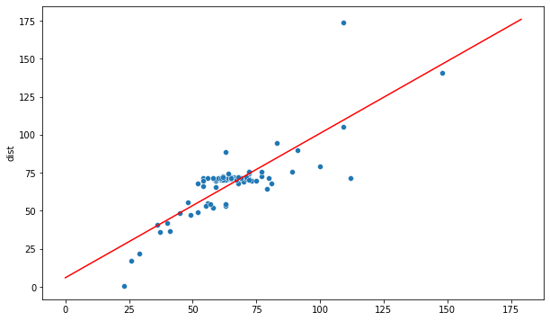
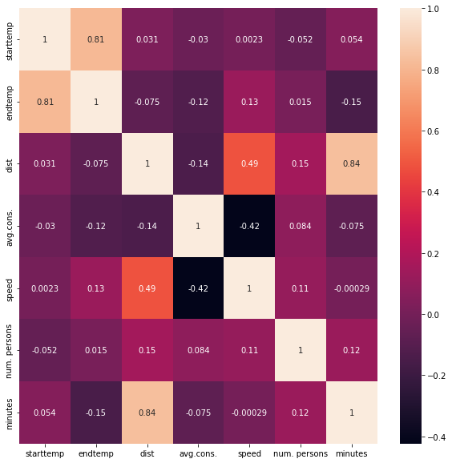
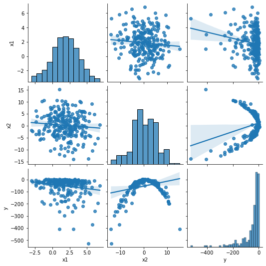
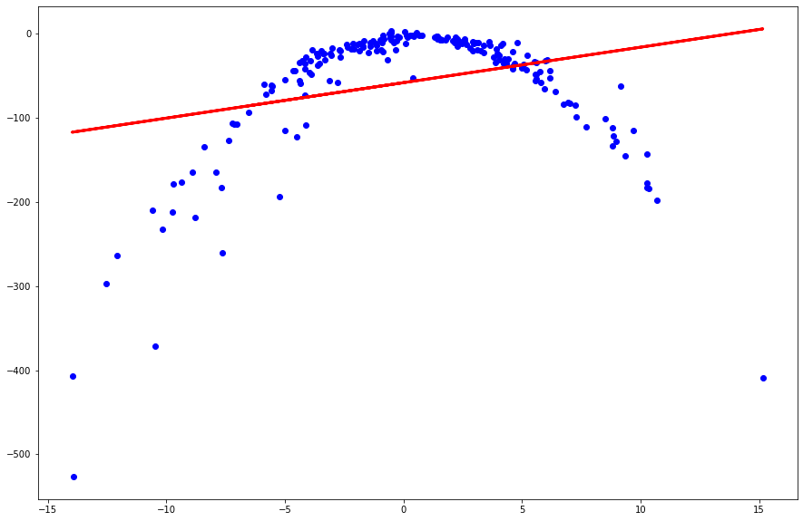
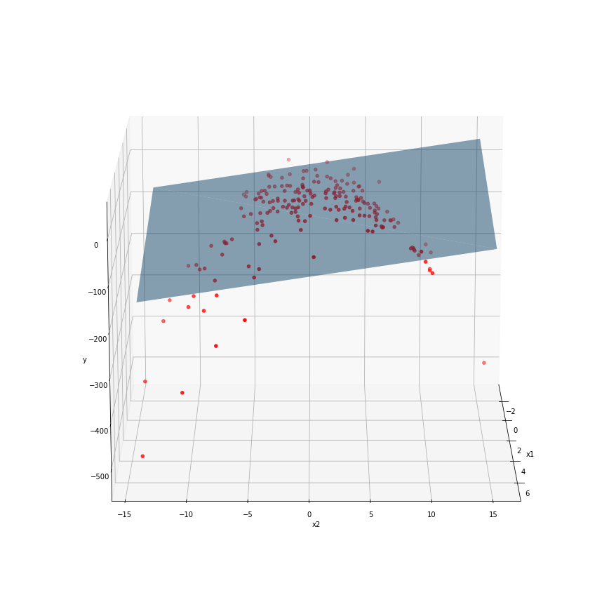
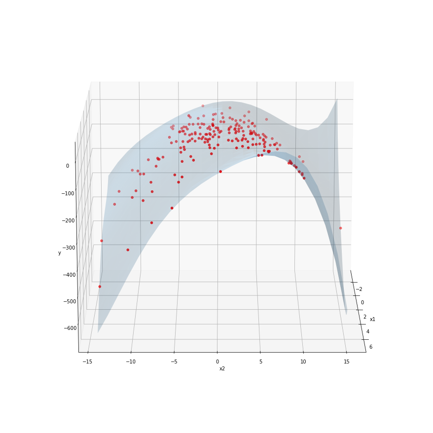

# Regression


```python
import pandas as pd

fuel = pd.read_csv('fuel_data.txt', delimiter='\t')
fuel['minutes'] = fuel['duration'].apply(
                        lambda time:int(time.split(':')[0])*60+int(time.split(':')[1]))

fuel.head()
```


<div>
<table border="1" class="dataframe">
  <thead>
    <tr style="text-align: right;">
      <th></th>
      <th>date</th>
      <th>starttime</th>
      <th>endtime</th>
      <th>starttemp</th>
      <th>endtemp</th>
      <th>air conditioner</th>
      <th>trafic</th>
      <th>route</th>
      <th>dist</th>
      <th>avg.cons.</th>
      <th>speed</th>
      <th>duration</th>
      <th>fuel type</th>
      <th>road</th>
      <th>num. persons</th>
      <th>minutes</th>
    </tr>
  </thead>
  <tbody>
    <tr>
      <th>0</th>
      <td>2018.06.03</td>
      <td>00:03</td>
      <td>01:16</td>
      <td>17</td>
      <td>15</td>
      <td>off</td>
      <td>low</td>
      <td>bp-dujv</td>
      <td>69.8</td>
      <td>4.5</td>
      <td>57</td>
      <td>01:13</td>
      <td>95+</td>
      <td>standard</td>
      <td>1</td>
      <td>73</td>
    </tr>
    <tr>
      <th>1</th>
      <td>2018.06.03</td>
      <td>08:20</td>
      <td>09:29</td>
      <td>19</td>
      <td>24</td>
      <td>off</td>
      <td>low</td>
      <td>dujv-bp</td>
      <td>68.6</td>
      <td>4.6</td>
      <td>59</td>
      <td>01:09</td>
      <td>95+</td>
      <td>standard</td>
      <td>2</td>
      <td>69</td>
    </tr>
    <tr>
      <th>2</th>
      <td>2018.06.03</td>
      <td>13:00</td>
      <td>15:00</td>
      <td>30</td>
      <td>28</td>
      <td>on</td>
      <td>normal</td>
      <td>bp-dujv</td>
      <td>79.5</td>
      <td>6.0</td>
      <td>47</td>
      <td>01:40</td>
      <td>95+</td>
      <td>standard</td>
      <td>3</td>
      <td>100</td>
    </tr>
    <tr>
      <th>3</th>
      <td>2018.06.04</td>
      <td>15:30</td>
      <td>16:30</td>
      <td>29</td>
      <td>28</td>
      <td>on</td>
      <td>normal</td>
      <td>dujv-szelid</td>
      <td>45.2</td>
      <td>4.3</td>
      <td>56</td>
      <td>00:48</td>
      <td>95+</td>
      <td>standard</td>
      <td>1</td>
      <td>48</td>
    </tr>
    <tr>
      <th>4</th>
      <td>2018.06.04</td>
      <td>18:18</td>
      <td>19:10</td>
      <td>30</td>
      <td>25</td>
      <td>on</td>
      <td>normal</td>
      <td>szelid-dujv</td>
      <td>47.5</td>
      <td>4.7</td>
      <td>57</td>
      <td>00:49</td>
      <td>95+</td>
      <td>standard</td>
      <td>1</td>
      <td>49</td>
    </tr>
  </tbody>
</table>
</div>


## Regressor


```python
from sklearn.linear_model import LinearRegression
from sklearn.metrics import mean_absolute_error, mean_squared_error
from sklearn.model_selection import train_test_split

x = fuel['minutes'].values.reshape(-1, 1)
y = fuel['dist']

xTrain, xTest, yTrain, yTest = train_test_split(x, y, test_size=0.2, random_state=101)

model1 = LinearRegression()
model1.fit(xTrain, yTrain)
```


    LinearRegression()


### Evaluation


```python
from math import sqrt

yPred = model1.predict(xTest)

rmse = sqrt(mean_squared_error(yTest, yPred))
mae = mean_absolute_error(yTest, yPred)

print(rmse)
print(mae)
```

    9.796223220262325
    7.218690232923228


### Visualisation


```python
import numpy as np
import matplotlib.pyplot as plt
import seaborn as sns

%matplotlib inline

interval = np.arange(0, 180)
yInterval = model1.predict(interval.reshape(-1,1))

plt.figure(figsize=(10,6))
xOriginal = [arr[0] for arr in xTrain]
sns.scatterplot(x=xOriginal, y=yTrain)
plt.plot(interval, yInterval, color='r')
```


    [<matplotlib.lines.Line2D at 0x7f9aa4713310>]


    

    


```python
x = fuel[['minutes', 'speed']].values
y = fuel['dist']

xTrain, xTest, yTrain, yTest = train_test_split(x, y, test_size=0.2, random_state=101)

model2 = LinearRegression()
model2.fit(xTrain, yTrain)

yPred = model2.predict(xTest)

rmse2 = sqrt(mean_squared_error(yTest, yPred))
mae2 = mean_absolute_error(yTest, yPred)

print(rmse2)
print(mae2)
```

    3.523379802675523
    1.9306478799891345


### Correlation


```python
plt.figure(figsize=(10, 10))
sns.heatmap(fuel.corr(), annot=True)
```


    <AxesSubplot:>


    

    


```python
x = fuel[['minutes', 'speed', 'num. persons']].values
y = fuel['dist']

xTrain, xTest, yTrain, yTest = train_test_split(x, y, test_size=0.2, random_state=101)

model3 = LinearRegression()
model3.fit(xTrain, yTrain)

yPred = model3.predict(xTest)

rmse3 = sqrt(mean_squared_error(yTest, yPred))
mae3 = mean_absolute_error(yTest, yPred)

print(rmse3)
print(mae3)
```

    3.5568743208171676
    1.888260853494937


```python
print("Model 1: ", ("RMSE = ", rmse, "MAE = ", mae))
print("Model 2: ", ("RMSE = ", rmse2, "MAE = ", mae2))
print("Model 3: ", ("RMSE = ", rmse3, "MAE = ", mae3))
```

    Model 1:  ('RMSE = ', 9.796223220262325, 'MAE = ', 7.218690232923228)
    Model 2:  ('RMSE = ', 3.523379802675523, 'MAE = ', 1.9306478799891345)
    Model 3:  ('RMSE = ', 3.5568743208171676, 'MAE = ', 1.888260853494937)


## Multiple Linear Regression


```python
pd.set_option('display.float_format', lambda x: '%.5f' % x)
df = pd.read_csv('multivar.csv')

df.head()
```


<div>
<table border="1" class="dataframe">
  <thead>
    <tr style="text-align: right;">
      <th></th>
      <th>x1</th>
      <th>x2</th>
      <th>y</th>
    </tr>
  </thead>
  <tbody>
    <tr>
      <th>0</th>
      <td>-1.24869</td>
      <td>-1.72494</td>
      <td>-14.70222</td>
    </tr>
    <tr>
      <th>1</th>
      <td>3.22351</td>
      <td>-1.15420</td>
      <td>-13.45638</td>
    </tr>
    <tr>
      <th>2</th>
      <td>3.05634</td>
      <td>-13.96543</td>
      <td>-407.35140</td>
    </tr>
    <tr>
      <th>3</th>
      <td>4.14594</td>
      <td>9.68764</td>
      <td>-114.54969</td>
    </tr>
    <tr>
      <th>4</th>
      <td>0.26918</td>
      <td>1.83166</td>
      <td>-8.97082</td>
    </tr>
  </tbody>
</table>
</div>


```python
df.describe()
```


<div>
<table border="1" class="dataframe">
  <thead>
    <tr style="text-align: right;">
      <th></th>
      <th>x1</th>
      <th>x2</th>
      <th>y</th>
    </tr>
  </thead>
  <tbody>
    <tr>
      <th>count</th>
      <td>250.00000</td>
      <td>250.00000</td>
      <td>250.00000</td>
    </tr>
    <tr>
      <th>mean</th>
      <td>1.84735</td>
      <td>0.15275</td>
      <td>-54.04077</td>
    </tr>
    <tr>
      <th>std</th>
      <td>1.90793</td>
      <td>5.12507</td>
      <td>76.31689</td>
    </tr>
    <tr>
      <th>min</th>
      <td>-3.05665</td>
      <td>-13.96543</td>
      <td>-526.70219</td>
    </tr>
    <tr>
      <th>25%</th>
      <td>0.61168</td>
      <td>-3.26172</td>
      <td>-58.19205</td>
    </tr>
    <tr>
      <th>50%</th>
      <td>1.84484</td>
      <td>-0.02292</td>
      <td>-24.40812</td>
    </tr>
    <tr>
      <th>75%</th>
      <td>3.19914</td>
      <td>3.86383</td>
      <td>-10.65910</td>
    </tr>
    <tr>
      <th>max</th>
      <td>6.86968</td>
      <td>15.15429</td>
      <td>4.01796</td>
    </tr>
  </tbody>
</table>
</div>


### Pairplot


```python
plt.figure(figsize=(15,15))
sns.pairplot(df, kind='reg')
```


    <seaborn.axisgrid.PairGrid at 0x7f9aa5a2ad50>


    <Figure size 1080x1080 with 0 Axes>


    

    


```python
x = df['x2'].values.reshape(-1, 1)
y = df['y']

xTrain, xTest, yTrain, yTest = train_test_split(x, y, test_size=0.2, random_state=101)

model = LinearRegression()
model.fit(xTrain, yTrain)

yPred = model.predict(xTrain)

plt.figure(figsize=(15, 10))
plt.scatter(xTrain, yTrain, color='b')
plt.plot(xTrain, yPred, color='r', linewidth=3)

plt.show()
```


    

    


### Two predictors


```python
columns=['x1', 'x2']
x = df[columns].values
y = df['y']

xTrain2, xTest2, yTrain2, yTest2 = train_test_split(x, y, test_size=0.2, random_state=101)

model2 = LinearRegression()
model2.fit(xTrain2, yTrain2)
```


    LinearRegression()


```python
from mpl_toolkits.mplot3d import Axes3D

fig = plt.figure(figsize=(16,12))

ax = Axes3D(fig, elev=15, azim=0)

ax.scatter(xTrain2[:,0], xTrain2[:,1], yTrain2, c='r', marker='o')
ax.plot_trisurf(np.array([df['x1'].min(), df['x1'].min(), df['x1'].max(), df['x1'].max()]),
                np.array([df['x2'].min(), df['x2'].max(), df['x2'].min(), df['x2'].max()]),
                model2.predict(np.array([[df['x1'].min(), df['x2'].min()],
                                         [df['x1'].min(), df['x2'].max()],
                                         [df['x1'].max(), df['x2'].min()],
                                         [df['x1'].max(), df['x2'].max()]])), 
                alpha=.5)

ax.set_xlabel('x1')
ax.set_ylabel('x2')
ax.set_zlabel('y')
```

    /Users/joseluis/opt/anaconda3/lib/python3.7/site-packages/ipykernel_launcher.py:5: MatplotlibDeprecationWarning: Axes3D(fig) adding itself to the figure is deprecated since 3.4. Pass the keyword argument auto_add_to_figure=False and use fig.add_axes(ax) to suppress this warning. The default value of auto_add_to_figure will change to False in mpl3.5 and True values will no longer work in 3.6.  This is consistent with other Axes classes.
      """


    Text(0.5, 0, 'y')


    

    


```python
from matplotlib.animation import FuncAnimation

def update(i):
    ax.azim = i
    return ax

anim = FuncAnimation(fig, update, frames=range(361), interval=33)

anim.save('3d_animation.gif', dpi=80, writer='imagemagick')
```

    MovieWriter imagemagick unavailable; using Pillow instead.


### Polynomial Regression


```python
from sklearn.preprocessing import PolynomialFeatures

x = df[columns].values
y = df['y']
poly= PolynomialFeatures(degree=6)

xTrain4, xTest4, yTrain4, yTest4 = train_test_split(x, y, test_size=0.2, random_state=101)

xTrain4 = poly.fit_transform(xTrain4)
xTest4 = poly.fit_transform(xTest4)

model4 = LinearRegression()
model4.fit(xTrain4, yTrain4)
```


    LinearRegression()


```python
print(model4.intercept_)
print(model4.coef_)
```

    -487930671.3822347
    [ 4.87930669e+08 -3.23965302e-01 -2.51286227e-01 -6.87850594e-01
      2.89171232e-01 -1.75291677e+00  2.09252071e-01  4.25555339e-01
      9.33576437e-02 -1.54414898e-02  3.49841233e-02 -5.10077331e-02
      2.07289618e-02  1.21408451e-02 -8.80410029e-04 -4.16579631e-02
      6.57358067e-03 -6.30980923e-03 -9.35126646e-04 -1.09994556e-03
      1.24734555e-04  4.44709208e-03 -9.89355180e-05  6.13591849e-04
      1.40875022e-04 -6.17350970e-06 -9.99085110e-05  5.49674885e-06]


```python
from sklearn.linear_model import Ridge, Lasso

model5 = Ridge(alpha=0.0001)
model5.fit(xTrain4, yTrain4)

print(model5.intercept_)
print(model5.coef_)

model6 = Lasso(alpha=0.0001, max_iter=10000)
model6.fit(xTrain4, yTrain4)

print(model6.intercept_)
print(model6.coef_)
```

    -1.1844932841340423
    [ 0.00000000e+00 -3.57236043e-01 -2.51164340e-01 -6.77339049e-01
      2.84787137e-01 -1.76168284e+00  2.08122641e-01  4.30346758e-01
      7.45337762e-02  8.96638327e-03  3.57893094e-02 -3.80664985e-02
      8.75248264e-05 -6.03825179e-03 -1.26446454e-03 -3.37170139e-02
      3.69304282e-03 -8.66728985e-03  4.06263685e-04 -4.20194884e-04
     -5.67480617e-05  3.28443003e-03  1.64822108e-04  1.17806171e-03
      2.10262664e-05  9.14208925e-05  2.55763991e-05  5.96008064e-06]
    -1.651857501288184
    [ 0.00000000e+00 -3.12462473e-01 -2.80362855e-01 -2.16996384e-01
      3.01435070e-01 -1.74313310e+00  7.39577916e-02  4.32751498e-01
      6.64631717e-02  9.83445587e-03  1.26494263e-03 -3.94039960e-02
     -8.02087369e-03 -6.95635113e-03 -1.35640146e-03 -1.90490684e-02
      4.03129631e-03 -4.79718919e-03  5.92197044e-04 -3.41676313e-04
     -5.87647190e-05  2.08997826e-03  1.22101807e-04  7.64904914e-04
      5.92636544e-06  8.13648090e-05  2.74633179e-05  5.94795243e-06]


```python
xs = []
ys = []

for x1 in np.linspace(df['x1'].min(), df['x1'].max(),25):
    for x2 in np.linspace(df['x2'].min(), df['x2'].max(),25):
        xs.append(x1)
        ys.append(x2)
        
xSurf = np.c_[xs, ys]
xSurfPoly = poly.fit_transform(xSurf)

zs = model4.predict(xSurfPoly)

fig = plt.figure(figsize=(16,12))

ax = Axes3D(fig, elev=15, azim=0)

ax.scatter(xTrain2[:,0], xTrain2[:,1], yTrain2, c='r', marker='o')
ax.plot_trisurf(xs, ys, zs, alpha=.2)

#2 -> 28

ax.set_xlabel('x1')
ax.set_ylabel('x2')
ax.set_zlabel('y')
```


    Text(0.5, 0, 'y')


    

    


```python
def update(i):
    ax.azim = i
    return ax

anim = FuncAnimation(fig, update, frames=range(361), interval=33)

anim.save('3d_model6.gif', dpi=80, writer='imagemagick')
```


```python

```
