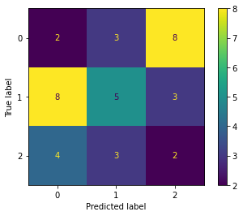
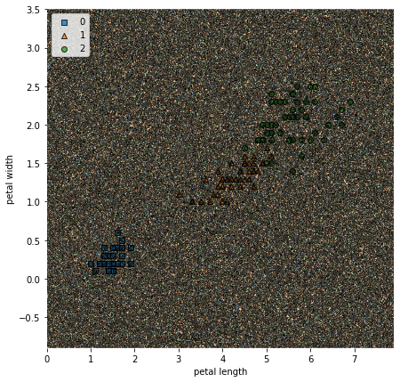
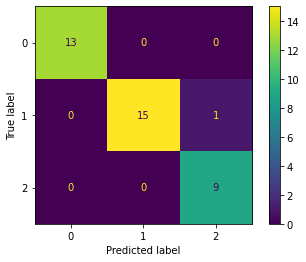
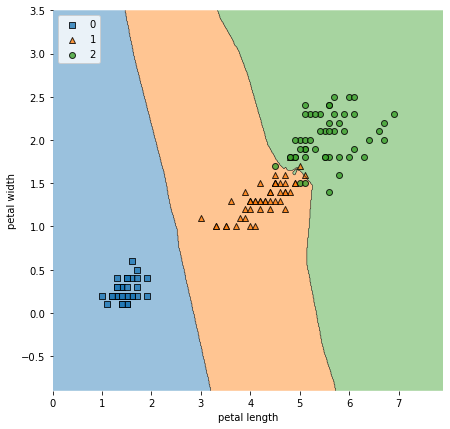
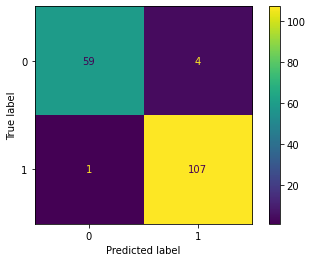

# Classification


```python
import warnings
warnings.simplefilter(action='ignore')
```


```python
from sklearn import datasets

iris = datasets.load_iris() #http://archive.ics.uci.edu/ml/datasets/Iris
print(iris.DESCR)
```

    .. _iris_dataset:
    
    Iris plants dataset
    --------------------
    
    **Data Set Characteristics:**
    
        :Number of Instances: 150 (50 in each of three classes)
        :Number of Attributes: 4 numeric, predictive attributes and the class
        :Attribute Information:
            - sepal length in cm
            - sepal width in cm
            - petal length in cm
            - petal width in cm
            - class:
                    - Iris-Setosa
                    - Iris-Versicolour
                    - Iris-Virginica
                    
        :Summary Statistics:
    
        ============== ==== ==== ======= ===== ====================
                        Min  Max   Mean    SD   Class Correlation
        ============== ==== ==== ======= ===== ====================
        sepal length:   4.3  7.9   5.84   0.83    0.7826
        sepal width:    2.0  4.4   3.05   0.43   -0.4194
        petal length:   1.0  6.9   3.76   1.76    0.9490  (high!)
        petal width:    0.1  2.5   1.20   0.76    0.9565  (high!)
        ============== ==== ==== ======= ===== ====================
    
        :Missing Attribute Values: None
        :Class Distribution: 33.3% for each of 3 classes.
        :Creator: R.A. Fisher
        :Donor: Michael Marshall (MARSHALL%PLU@io.arc.nasa.gov)
        :Date: July, 1988
    
    The famous Iris database, first used by Sir R.A. Fisher. The dataset is taken
    from Fisher's paper. Note that it's the same as in R, but not as in the UCI
    Machine Learning Repository, which has two wrong data points.
    
    This is perhaps the best known database to be found in the
    pattern recognition literature.  Fisher's paper is a classic in the field and
    is referenced frequently to this day.  (See Duda & Hart, for example.)  The
    data set contains 3 classes of 50 instances each, where each class refers to a
    type of iris plant.  One class is linearly separable from the other 2; the
    latter are NOT linearly separable from each other.
    
    .. topic:: References
    
       - Fisher, R.A. "The use of multiple measurements in taxonomic problems"
         Annual Eugenics, 7, Part II, 179-188 (1936); also in "Contributions to
         Mathematical Statistics" (John Wiley, NY, 1950).
       - Duda, R.O., & Hart, P.E. (1973) Pattern Classification and Scene Analysis.
         (Q327.D83) John Wiley & Sons.  ISBN 0-471-22361-1.  See page 218.
       - Dasarathy, B.V. (1980) "Nosing Around the Neighborhood: A New System
         Structure and Classification Rule for Recognition in Partially Exposed
         Environments".  IEEE Transactions on Pattern Analysis and Machine
         Intelligence, Vol. PAMI-2, No. 1, 67-71.
       - Gates, G.W. (1972) "The Reduced Nearest Neighbor Rule".  IEEE Transactions
         on Information Theory, May 1972, 431-433.
       - See also: 1988 MLC Proceedings, 54-64.  Cheeseman et al"s AUTOCLASS II
         conceptual clustering system finds 3 classes in the data.
       - Many, many more ...


```python
import pandas as pd
import numpy as np

df = pd.DataFrame(data=np.c_[iris['data'], iris['target']],
                 columns=iris['feature_names']+['target'])

df
```


<div>
<table border="1" class="dataframe">
  <thead>
    <tr style="text-align: right;">
      <th></th>
      <th>sepal length (cm)</th>
      <th>sepal width (cm)</th>
      <th>petal length (cm)</th>
      <th>petal width (cm)</th>
      <th>target</th>
    </tr>
  </thead>
  <tbody>
    <tr>
      <th>0</th>
      <td>5.1</td>
      <td>3.5</td>
      <td>1.4</td>
      <td>0.2</td>
      <td>0.0</td>
    </tr>
    <tr>
      <th>1</th>
      <td>4.9</td>
      <td>3.0</td>
      <td>1.4</td>
      <td>0.2</td>
      <td>0.0</td>
    </tr>
    <tr>
      <th>2</th>
      <td>4.7</td>
      <td>3.2</td>
      <td>1.3</td>
      <td>0.2</td>
      <td>0.0</td>
    </tr>
    <tr>
      <th>3</th>
      <td>4.6</td>
      <td>3.1</td>
      <td>1.5</td>
      <td>0.2</td>
      <td>0.0</td>
    </tr>
    <tr>
      <th>4</th>
      <td>5.0</td>
      <td>3.6</td>
      <td>1.4</td>
      <td>0.2</td>
      <td>0.0</td>
    </tr>
    <tr>
      <th>...</th>
      <td>...</td>
      <td>...</td>
      <td>...</td>
      <td>...</td>
      <td>...</td>
    </tr>
    <tr>
      <th>145</th>
      <td>6.7</td>
      <td>3.0</td>
      <td>5.2</td>
      <td>2.3</td>
      <td>2.0</td>
    </tr>
    <tr>
      <th>146</th>
      <td>6.3</td>
      <td>2.5</td>
      <td>5.0</td>
      <td>1.9</td>
      <td>2.0</td>
    </tr>
    <tr>
      <th>147</th>
      <td>6.5</td>
      <td>3.0</td>
      <td>5.2</td>
      <td>2.0</td>
      <td>2.0</td>
    </tr>
    <tr>
      <th>148</th>
      <td>6.2</td>
      <td>3.4</td>
      <td>5.4</td>
      <td>2.3</td>
      <td>2.0</td>
    </tr>
    <tr>
      <th>149</th>
      <td>5.9</td>
      <td>3.0</td>
      <td>5.1</td>
      <td>1.8</td>
      <td>2.0</td>
    </tr>
  </tbody>
</table>
<p>150 rows × 5 columns</p>
</div>


```python
from sklearn.model_selection import train_test_split

x = iris.data
y = iris.target

xTrain, xTest, yTrain, yTest = train_test_split(x, y, test_size=0.25, random_state=42)

dfTest = pd.DataFrame(data=np.c_[xTest, yTest],
                 columns=iris['feature_names']+['target'])

dfTest
```


<div>
<table border="1" class="dataframe">
  <thead>
    <tr style="text-align: right;">
      <th></th>
      <th>sepal length (cm)</th>
      <th>sepal width (cm)</th>
      <th>petal length (cm)</th>
      <th>petal width (cm)</th>
      <th>target</th>
    </tr>
  </thead>
  <tbody>
    <tr>
      <th>0</th>
      <td>6.1</td>
      <td>2.8</td>
      <td>4.7</td>
      <td>1.2</td>
      <td>1.0</td>
    </tr>
    <tr>
      <th>1</th>
      <td>5.7</td>
      <td>3.8</td>
      <td>1.7</td>
      <td>0.3</td>
      <td>0.0</td>
    </tr>
    <tr>
      <th>2</th>
      <td>7.7</td>
      <td>2.6</td>
      <td>6.9</td>
      <td>2.3</td>
      <td>2.0</td>
    </tr>
    <tr>
      <th>3</th>
      <td>6.0</td>
      <td>2.9</td>
      <td>4.5</td>
      <td>1.5</td>
      <td>1.0</td>
    </tr>
    <tr>
      <th>4</th>
      <td>6.8</td>
      <td>2.8</td>
      <td>4.8</td>
      <td>1.4</td>
      <td>1.0</td>
    </tr>
    <tr>
      <th>5</th>
      <td>5.4</td>
      <td>3.4</td>
      <td>1.5</td>
      <td>0.4</td>
      <td>0.0</td>
    </tr>
    <tr>
      <th>6</th>
      <td>5.6</td>
      <td>2.9</td>
      <td>3.6</td>
      <td>1.3</td>
      <td>1.0</td>
    </tr>
    <tr>
      <th>7</th>
      <td>6.9</td>
      <td>3.1</td>
      <td>5.1</td>
      <td>2.3</td>
      <td>2.0</td>
    </tr>
    <tr>
      <th>8</th>
      <td>6.2</td>
      <td>2.2</td>
      <td>4.5</td>
      <td>1.5</td>
      <td>1.0</td>
    </tr>
    <tr>
      <th>9</th>
      <td>5.8</td>
      <td>2.7</td>
      <td>3.9</td>
      <td>1.2</td>
      <td>1.0</td>
    </tr>
    <tr>
      <th>10</th>
      <td>6.5</td>
      <td>3.2</td>
      <td>5.1</td>
      <td>2.0</td>
      <td>2.0</td>
    </tr>
    <tr>
      <th>11</th>
      <td>4.8</td>
      <td>3.0</td>
      <td>1.4</td>
      <td>0.1</td>
      <td>0.0</td>
    </tr>
    <tr>
      <th>12</th>
      <td>5.5</td>
      <td>3.5</td>
      <td>1.3</td>
      <td>0.2</td>
      <td>0.0</td>
    </tr>
    <tr>
      <th>13</th>
      <td>4.9</td>
      <td>3.1</td>
      <td>1.5</td>
      <td>0.1</td>
      <td>0.0</td>
    </tr>
    <tr>
      <th>14</th>
      <td>5.1</td>
      <td>3.8</td>
      <td>1.5</td>
      <td>0.3</td>
      <td>0.0</td>
    </tr>
    <tr>
      <th>15</th>
      <td>6.3</td>
      <td>3.3</td>
      <td>4.7</td>
      <td>1.6</td>
      <td>1.0</td>
    </tr>
    <tr>
      <th>16</th>
      <td>6.5</td>
      <td>3.0</td>
      <td>5.8</td>
      <td>2.2</td>
      <td>2.0</td>
    </tr>
    <tr>
      <th>17</th>
      <td>5.6</td>
      <td>2.5</td>
      <td>3.9</td>
      <td>1.1</td>
      <td>1.0</td>
    </tr>
    <tr>
      <th>18</th>
      <td>5.7</td>
      <td>2.8</td>
      <td>4.5</td>
      <td>1.3</td>
      <td>1.0</td>
    </tr>
    <tr>
      <th>19</th>
      <td>6.4</td>
      <td>2.8</td>
      <td>5.6</td>
      <td>2.2</td>
      <td>2.0</td>
    </tr>
    <tr>
      <th>20</th>
      <td>4.7</td>
      <td>3.2</td>
      <td>1.6</td>
      <td>0.2</td>
      <td>0.0</td>
    </tr>
    <tr>
      <th>21</th>
      <td>6.1</td>
      <td>3.0</td>
      <td>4.9</td>
      <td>1.8</td>
      <td>2.0</td>
    </tr>
    <tr>
      <th>22</th>
      <td>5.0</td>
      <td>3.4</td>
      <td>1.6</td>
      <td>0.4</td>
      <td>0.0</td>
    </tr>
    <tr>
      <th>23</th>
      <td>6.4</td>
      <td>2.8</td>
      <td>5.6</td>
      <td>2.1</td>
      <td>2.0</td>
    </tr>
    <tr>
      <th>24</th>
      <td>7.9</td>
      <td>3.8</td>
      <td>6.4</td>
      <td>2.0</td>
      <td>2.0</td>
    </tr>
    <tr>
      <th>25</th>
      <td>6.7</td>
      <td>3.0</td>
      <td>5.2</td>
      <td>2.3</td>
      <td>2.0</td>
    </tr>
    <tr>
      <th>26</th>
      <td>6.7</td>
      <td>2.5</td>
      <td>5.8</td>
      <td>1.8</td>
      <td>2.0</td>
    </tr>
    <tr>
      <th>27</th>
      <td>6.8</td>
      <td>3.2</td>
      <td>5.9</td>
      <td>2.3</td>
      <td>2.0</td>
    </tr>
    <tr>
      <th>28</th>
      <td>4.8</td>
      <td>3.0</td>
      <td>1.4</td>
      <td>0.3</td>
      <td>0.0</td>
    </tr>
    <tr>
      <th>29</th>
      <td>4.8</td>
      <td>3.1</td>
      <td>1.6</td>
      <td>0.2</td>
      <td>0.0</td>
    </tr>
    <tr>
      <th>30</th>
      <td>4.6</td>
      <td>3.6</td>
      <td>1.0</td>
      <td>0.2</td>
      <td>0.0</td>
    </tr>
    <tr>
      <th>31</th>
      <td>5.7</td>
      <td>4.4</td>
      <td>1.5</td>
      <td>0.4</td>
      <td>0.0</td>
    </tr>
    <tr>
      <th>32</th>
      <td>6.7</td>
      <td>3.1</td>
      <td>4.4</td>
      <td>1.4</td>
      <td>1.0</td>
    </tr>
    <tr>
      <th>33</th>
      <td>4.8</td>
      <td>3.4</td>
      <td>1.6</td>
      <td>0.2</td>
      <td>0.0</td>
    </tr>
    <tr>
      <th>34</th>
      <td>4.4</td>
      <td>3.2</td>
      <td>1.3</td>
      <td>0.2</td>
      <td>0.0</td>
    </tr>
    <tr>
      <th>35</th>
      <td>6.3</td>
      <td>2.5</td>
      <td>5.0</td>
      <td>1.9</td>
      <td>2.0</td>
    </tr>
    <tr>
      <th>36</th>
      <td>6.4</td>
      <td>3.2</td>
      <td>4.5</td>
      <td>1.5</td>
      <td>1.0</td>
    </tr>
    <tr>
      <th>37</th>
      <td>5.2</td>
      <td>3.5</td>
      <td>1.5</td>
      <td>0.2</td>
      <td>0.0</td>
    </tr>
  </tbody>
</table>
</div>


```python
x = iris.data[:, 2:]

xTrain, xTest, yTrain, yTest = train_test_split(x, y, test_size=0.25, random_state=1)

dfTest = pd.DataFrame(data=np.c_[xTest, yTest],
                 columns=iris['feature_names'][2:]+['target'])

dfTest
```


<div>
<table border="1" class="dataframe">
  <thead>
    <tr style="text-align: right;">
      <th></th>
      <th>petal length (cm)</th>
      <th>petal width (cm)</th>
      <th>target</th>
    </tr>
  </thead>
  <tbody>
    <tr>
      <th>0</th>
      <td>1.2</td>
      <td>0.2</td>
      <td>0.0</td>
    </tr>
    <tr>
      <th>1</th>
      <td>3.0</td>
      <td>1.1</td>
      <td>1.0</td>
    </tr>
    <tr>
      <th>2</th>
      <td>4.4</td>
      <td>1.4</td>
      <td>1.0</td>
    </tr>
    <tr>
      <th>3</th>
      <td>1.3</td>
      <td>0.4</td>
      <td>0.0</td>
    </tr>
    <tr>
      <th>4</th>
      <td>6.4</td>
      <td>2.0</td>
      <td>2.0</td>
    </tr>
    <tr>
      <th>5</th>
      <td>4.7</td>
      <td>1.6</td>
      <td>1.0</td>
    </tr>
    <tr>
      <th>6</th>
      <td>5.1</td>
      <td>2.3</td>
      <td>2.0</td>
    </tr>
    <tr>
      <th>7</th>
      <td>1.9</td>
      <td>0.4</td>
      <td>0.0</td>
    </tr>
    <tr>
      <th>8</th>
      <td>1.6</td>
      <td>0.2</td>
      <td>0.0</td>
    </tr>
    <tr>
      <th>9</th>
      <td>5.7</td>
      <td>2.3</td>
      <td>2.0</td>
    </tr>
    <tr>
      <th>10</th>
      <td>4.2</td>
      <td>1.3</td>
      <td>1.0</td>
    </tr>
    <tr>
      <th>11</th>
      <td>1.7</td>
      <td>0.4</td>
      <td>0.0</td>
    </tr>
    <tr>
      <th>12</th>
      <td>5.9</td>
      <td>2.1</td>
      <td>2.0</td>
    </tr>
    <tr>
      <th>13</th>
      <td>4.5</td>
      <td>1.5</td>
      <td>1.0</td>
    </tr>
    <tr>
      <th>14</th>
      <td>4.5</td>
      <td>1.5</td>
      <td>1.0</td>
    </tr>
    <tr>
      <th>15</th>
      <td>1.3</td>
      <td>0.2</td>
      <td>0.0</td>
    </tr>
    <tr>
      <th>16</th>
      <td>4.0</td>
      <td>1.2</td>
      <td>1.0</td>
    </tr>
    <tr>
      <th>17</th>
      <td>4.5</td>
      <td>1.5</td>
      <td>1.0</td>
    </tr>
    <tr>
      <th>18</th>
      <td>1.5</td>
      <td>0.4</td>
      <td>0.0</td>
    </tr>
    <tr>
      <th>19</th>
      <td>1.2</td>
      <td>0.2</td>
      <td>0.0</td>
    </tr>
    <tr>
      <th>20</th>
      <td>4.4</td>
      <td>1.2</td>
      <td>1.0</td>
    </tr>
    <tr>
      <th>21</th>
      <td>4.5</td>
      <td>1.5</td>
      <td>1.0</td>
    </tr>
    <tr>
      <th>22</th>
      <td>5.0</td>
      <td>1.7</td>
      <td>1.0</td>
    </tr>
    <tr>
      <th>23</th>
      <td>1.3</td>
      <td>0.3</td>
      <td>0.0</td>
    </tr>
    <tr>
      <th>24</th>
      <td>6.0</td>
      <td>1.8</td>
      <td>2.0</td>
    </tr>
    <tr>
      <th>25</th>
      <td>4.1</td>
      <td>1.3</td>
      <td>1.0</td>
    </tr>
    <tr>
      <th>26</th>
      <td>1.4</td>
      <td>0.2</td>
      <td>0.0</td>
    </tr>
    <tr>
      <th>27</th>
      <td>1.5</td>
      <td>0.3</td>
      <td>0.0</td>
    </tr>
    <tr>
      <th>28</th>
      <td>4.7</td>
      <td>1.2</td>
      <td>1.0</td>
    </tr>
    <tr>
      <th>29</th>
      <td>5.0</td>
      <td>1.9</td>
      <td>2.0</td>
    </tr>
    <tr>
      <th>30</th>
      <td>4.6</td>
      <td>1.4</td>
      <td>1.0</td>
    </tr>
    <tr>
      <th>31</th>
      <td>6.1</td>
      <td>2.3</td>
      <td>2.0</td>
    </tr>
    <tr>
      <th>32</th>
      <td>3.9</td>
      <td>1.1</td>
      <td>1.0</td>
    </tr>
    <tr>
      <th>33</th>
      <td>5.6</td>
      <td>2.1</td>
      <td>2.0</td>
    </tr>
    <tr>
      <th>34</th>
      <td>5.1</td>
      <td>2.4</td>
      <td>2.0</td>
    </tr>
    <tr>
      <th>35</th>
      <td>1.5</td>
      <td>0.2</td>
      <td>0.0</td>
    </tr>
    <tr>
      <th>36</th>
      <td>4.0</td>
      <td>1.3</td>
      <td>1.0</td>
    </tr>
    <tr>
      <th>37</th>
      <td>1.4</td>
      <td>0.2</td>
      <td>0.0</td>
    </tr>
  </tbody>
</table>
</div>


## First try


```python
from sklearn.dummy import DummyClassifier

dum = DummyClassifier(strategy='stratified')
dum.fit(xTrain, yTrain)

from sklearn.metrics import classification_report

dumPred = dum.predict(xTest)

print(classification_report(yTest, dumPred))
```

                  precision    recall  f1-score   support
    
               0       0.33      0.31      0.32        13
               1       0.46      0.38      0.41        16
               2       0.15      0.22      0.18         9
    
        accuracy                           0.32        38
       macro avg       0.32      0.30      0.31        38
    weighted avg       0.34      0.32      0.33        38
    


```python
print(yTest)
print(dumPred)
```

    [0 1 1 0 2 1 2 0 0 2 1 0 2 1 1 0 1 1 0 0 1 1 1 0 2 1 0 0 1 2 1 2 1 2 2 0 1
     0]
    [2 0 0 0 2 1 2 2 1 0 1 1 0 0 2 1 1 2 0 2 2 2 1 2 0 2 0 0 2 0 0 1 1 1 1 2 1
     1]


```python
from sklearn.metrics import balanced_accuracy_score, f1_score, log_loss

dumProb = dum.predict_proba(xTest)

print("Accuracy: ", balanced_accuracy_score(yTest, dumPred))
print("F1: ", f1_score(yTest, dumPred, average='weighted'))
print("Loss: ", log_loss(yTest, dumProb))
```

    Accuracy:  0.30163817663817666
    F1:  0.32676456030358025
    Loss:  19.087218534029585


```python
from sklearn.metrics import plot_confusion_matrix
import matplotlib.pyplot as plt
%matplotlib inline

plot_confusion_matrix(dum, xTest, yTest)
```


    <sklearn.metrics._plot.confusion_matrix.ConfusionMatrixDisplay at 0x7fafe5367810>


    

    

```python
from mlxtend.plotting import plot_decision_regions

xCombined = np.vstack((xTrain, xTest))
yCombined = np.hstack((yTrain, yTest))

fig, ax = plt.subplots(figsize=(7,7))

plot_decision_regions(xCombined, yCombined, clf=dum)
plt.xlabel("petal length")
plt.ylabel("petal width")
plt.legend(loc='upper left')
plt.show()
```


    

    


```python
from sklearn.neighbors import KNeighborsClassifier

knn = KNeighborsClassifier(n_neighbors=5)
knn.fit(xTrain, yTrain)

knnPred = knn.predict(xTest)
knnProb = knn.predict_proba(xTest)

print(classification_report(yTest, knnPred))
```

                  precision    recall  f1-score   support
    
               0       1.00      1.00      1.00        13
               1       1.00      0.94      0.97        16
               2       0.90      1.00      0.95         9
    
        accuracy                           0.97        38
       macro avg       0.97      0.98      0.97        38
    weighted avg       0.98      0.97      0.97        38
    


```python
plot_confusion_matrix(knn, xTest, yTest)
```


    <sklearn.metrics._plot.confusion_matrix.ConfusionMatrixDisplay at 0x7fafcabc1090>


    

    


```python
print(balanced_accuracy_score(yTest, knnPred))
print(f1_score(yTest, knnPred, average='weighted'))
print(log_loss(yTest, knnProb))
```

    0.9791666666666666
    0.9739522830846216
    0.04235362927458369


```python
fig, ax = plt.subplots(figsize=(7,7))

plot_decision_regions(xCombined, yCombined, clf=knn)
plt.xlabel("petal length")
plt.ylabel("petal width")
plt.legend(loc='upper left')
plt.show()
```


    

    


### A little more complex


```python
breast_cancer = datasets.load_breast_cancer()
print(breast_cancer.DESCR)
```

    .. _breast_cancer_dataset:
    
    Breast cancer wisconsin (diagnostic) dataset
    --------------------------------------------
    
    **Data Set Characteristics:**
    
        :Number of Instances: 569
    
        :Number of Attributes: 30 numeric, predictive attributes and the class
    
        :Attribute Information:
            - radius (mean of distances from center to points on the perimeter)
            - texture (standard deviation of gray-scale values)
            - perimeter
            - area
            - smoothness (local variation in radius lengths)
            - compactness (perimeter^2 / area - 1.0)
            - concavity (severity of concave portions of the contour)
            - concave points (number of concave portions of the contour)
            - symmetry
            - fractal dimension ("coastline approximation" - 1)
    
            The mean, standard error, and "worst" or largest (mean of the three
            worst/largest values) of these features were computed for each image,
            resulting in 30 features.  For instance, field 0 is Mean Radius, field
            10 is Radius SE, field 20 is Worst Radius.
    
            - class:
                    - WDBC-Malignant
                    - WDBC-Benign
    
        :Summary Statistics:
    
        ===================================== ====== ======
                                               Min    Max
        ===================================== ====== ======
        radius (mean):                        6.981  28.11
        texture (mean):                       9.71   39.28
        perimeter (mean):                     43.79  188.5
        area (mean):                          143.5  2501.0
        smoothness (mean):                    0.053  0.163
        compactness (mean):                   0.019  0.345
        concavity (mean):                     0.0    0.427
        concave points (mean):                0.0    0.201
        symmetry (mean):                      0.106  0.304
        fractal dimension (mean):             0.05   0.097
        radius (standard error):              0.112  2.873
        texture (standard error):             0.36   4.885
        perimeter (standard error):           0.757  21.98
        area (standard error):                6.802  542.2
        smoothness (standard error):          0.002  0.031
        compactness (standard error):         0.002  0.135
        concavity (standard error):           0.0    0.396
        concave points (standard error):      0.0    0.053
        symmetry (standard error):            0.008  0.079
        fractal dimension (standard error):   0.001  0.03
        radius (worst):                       7.93   36.04
        texture (worst):                      12.02  49.54
        perimeter (worst):                    50.41  251.2
        area (worst):                         185.2  4254.0
        smoothness (worst):                   0.071  0.223
        compactness (worst):                  0.027  1.058
        concavity (worst):                    0.0    1.252
        concave points (worst):               0.0    0.291
        symmetry (worst):                     0.156  0.664
        fractal dimension (worst):            0.055  0.208
        ===================================== ====== ======
    
        :Missing Attribute Values: None
    
        :Class Distribution: 212 - Malignant, 357 - Benign
    
        :Creator:  Dr. William H. Wolberg, W. Nick Street, Olvi L. Mangasarian
    
        :Donor: Nick Street
    
        :Date: November, 1995
    
    This is a copy of UCI ML Breast Cancer Wisconsin (Diagnostic) datasets.
    https://goo.gl/U2Uwz2
    
    Features are computed from a digitized image of a fine needle
    aspirate (FNA) of a breast mass.  They describe
    characteristics of the cell nuclei present in the image.
    
    Separating plane described above was obtained using
    Multisurface Method-Tree (MSM-T) [K. P. Bennett, "Decision Tree
    Construction Via Linear Programming." Proceedings of the 4th
    Midwest Artificial Intelligence and Cognitive Science Society,
    pp. 97-101, 1992], a classification method which uses linear
    programming to construct a decision tree.  Relevant features
    were selected using an exhaustive search in the space of 1-4
    features and 1-3 separating planes.
    
    The actual linear program used to obtain the separating plane
    in the 3-dimensional space is that described in:
    [K. P. Bennett and O. L. Mangasarian: "Robust Linear
    Programming Discrimination of Two Linearly Inseparable Sets",
    Optimization Methods and Software 1, 1992, 23-34].
    
    This database is also available through the UW CS ftp server:
    
    ftp ftp.cs.wisc.edu
    cd math-prog/cpo-dataset/machine-learn/WDBC/
    
    .. topic:: References
    
       - W.N. Street, W.H. Wolberg and O.L. Mangasarian. Nuclear feature extraction 
         for breast tumor diagnosis. IS&T/SPIE 1993 International Symposium on 
         Electronic Imaging: Science and Technology, volume 1905, pages 861-870,
         San Jose, CA, 1993.
       - O.L. Mangasarian, W.N. Street and W.H. Wolberg. Breast cancer diagnosis and 
         prognosis via linear programming. Operations Research, 43(4), pages 570-577, 
         July-August 1995.
       - W.H. Wolberg, W.N. Street, and O.L. Mangasarian. Machine learning techniques
         to diagnose breast cancer from fine-needle aspirates. Cancer Letters 77 (1994) 
         163-171.


```python
x = breast_cancer.data
y = breast_cancer.target

xTrain, xTest, yTrain, yTest = train_test_split(x, y, test_size=0.3, random_state=42)
```

## Logistic Regression


```python
from sklearn.linear_model import LogisticRegression

lr = LogisticRegression(max_iter=100)
lr.fit(xTrain, yTrain)

lrPred = lr.predict(xTest)
lrProb = lr.predict_proba(xTest)

print(classification_report(yTest, lrPred))
```

                  precision    recall  f1-score   support
    
               0       0.98      0.94      0.96        63
               1       0.96      0.99      0.98       108
    
        accuracy                           0.97       171
       macro avg       0.97      0.96      0.97       171
    weighted avg       0.97      0.97      0.97       171
    


```python
plot_confusion_matrix(lr, xTest, yTest)
```


    <sklearn.metrics._plot.confusion_matrix.ConfusionMatrixDisplay at 0x7fafcd8ecd10>


    

    


```python
print("Accuracy: ", balanced_accuracy_score(yTest, lrPred))
print("F1: ", f1_score(yTest, lrPred, average='weighted'))
print("Loss: ", log_loss(yTest, lrProb))
```

    Accuracy:  0.9636243386243386
    F1:  0.970603923775359
    Loss:  0.08055617872005282


## Gaussian Naive Bayes


```python
from sklearn.naive_bayes import GaussianNB

gnb = GaussianNB()
gnb.fit(xTrain, yTrain)

gnbPred = gnb.predict(xTest)
gnbProb = gnb.predict_proba(xTest)

print(classification_report(yTest, gnbPred))
```

                  precision    recall  f1-score   support
    
               0       0.93      0.90      0.92        63
               1       0.95      0.96      0.95       108
    
        accuracy                           0.94       171
       macro avg       0.94      0.93      0.94       171
    weighted avg       0.94      0.94      0.94       171
    


```python
plot_confusion_matrix(gnb, xTest, yTest)
```


    <sklearn.metrics._plot.confusion_matrix.ConfusionMatrixDisplay at 0x7fafcd97be10>


    

    


```python
print("Accuracy: ", balanced_accuracy_score(yTest, gnbPred))
print("F1: ", f1_score(yTest, gnbPred, average='weighted'))
print("Loss: ", log_loss(yTest, gnbProb))
```

    Accuracy:  0.9338624338624338
    F1:  0.9413171134406007
    Loss:  0.48986013210958895


## K-Nearest Neighbors


```python
knn = KNeighborsClassifier(n_neighbors = 3)
knn.fit(xTrain, yTrain)

knnPred = knn.predict(xTest)
knnProb = knn.predict_proba(xTest)

print(classification_report(yTest, knnPred))
```

                  precision    recall  f1-score   support
    
               0       0.93      0.90      0.92        63
               1       0.95      0.96      0.95       108
    
        accuracy                           0.94       171
       macro avg       0.94      0.93      0.94       171
    weighted avg       0.94      0.94      0.94       171
    


```python
plot_confusion_matrix(knn, xTest, yTest)
```


    <sklearn.metrics._plot.confusion_matrix.ConfusionMatrixDisplay at 0x7fafcda86210>


    

    


```python
print("Accuracy: ", balanced_accuracy_score(yTest, knnPred))
print("F1: ", f1_score(yTest, knnPred, average='weighted'))
print("Loss: ", log_loss(yTest, knnProb))
```

    Accuracy:  0.9338624338624338
    F1:  0.9413171134406007
    Loss:  0.09507116545080345


### Hyperparameter Optimization


```python
from sklearn.model_selection import GridSearchCV

hyper_params = {
    'n_neighbors': range(1,16), #starting zero does not make sense. last element NOT included
    'p': range(1, 5)
}

# Too many hyperparameters
# Range is too big

grid = GridSearchCV(KNeighborsClassifier(), hyper_params)
grid.fit(xTrain, yTrain)
```


    GridSearchCV(estimator=KNeighborsClassifier(),
                 param_grid={'n_neighbors': range(1, 16), 'p': range(1, 5)})


```python
grid.best_params_
```


    {'n_neighbors': 5, 'p': 1}


```python
knn_model = KNeighborsClassifier(n_neighbors = grid.best_params_['n_neighbors'], 
                                 p=grid.best_params_['p'])
knn_model.fit(xTrain, yTrain)

knn2Pred = knn_model.predict(xTest)
knn2Prob = knn_model.predict_proba(xTest)

print(classification_report(yTest, knn2Pred))
```

                  precision    recall  f1-score   support
    
               0       0.97      0.92      0.94        63
               1       0.95      0.98      0.97       108
    
        accuracy                           0.96       171
       macro avg       0.96      0.95      0.96       171
    weighted avg       0.96      0.96      0.96       171
    


```python
plot_confusion_matrix(knn_model, xTest, yTest)
```


    <sklearn.metrics._plot.confusion_matrix.ConfusionMatrixDisplay at 0x7fafe9a3c790>


    

    


```python
print("Accuracy: ", balanced_accuracy_score(yTest, knn2Pred))
print("F1: ", f1_score(yTest, knn2Pred, average='weighted'))
print("Loss: ", log_loss(yTest, knn2Prob))
```

    Accuracy:  0.951058201058201
    F1:  0.9588454932855025
    Loss:  0.08304101740672311

