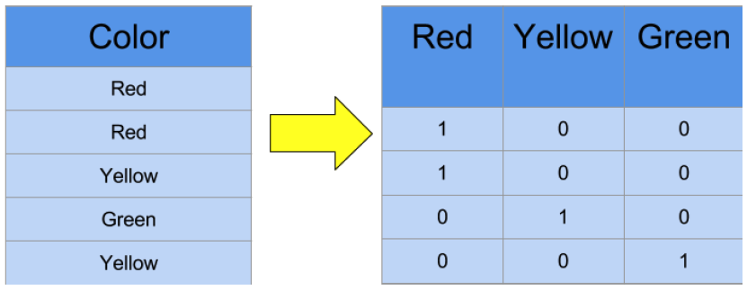
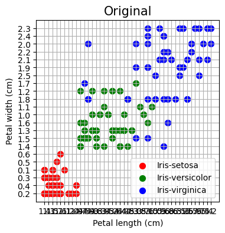
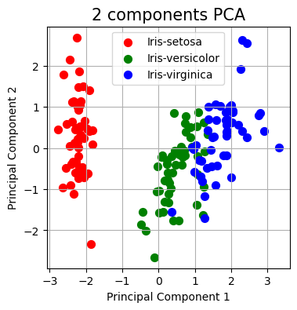

# Data Preprocessing

## Importing and Slicing


```python
import pandas as pd
import numpy as np
```


```python
dataset = pd.read_csv('Data.csv')
dataset
```


<div>
<table border="1" class="dataframe">
  <thead>
    <tr style="text-align: right;">
      <th></th>
      <th>Country</th>
      <th>Age</th>
      <th>Salary</th>
      <th>Purchased</th>
    </tr>
  </thead>
  <tbody>
    <tr>
      <th>0</th>
      <td>France</td>
      <td>44.0</td>
      <td>72000.0</td>
      <td>No</td>
    </tr>
    <tr>
      <th>1</th>
      <td>Spain</td>
      <td>27.0</td>
      <td>48000.0</td>
      <td>Yes</td>
    </tr>
    <tr>
      <th>2</th>
      <td>Germany</td>
      <td>30.0</td>
      <td>54000.0</td>
      <td>No</td>
    </tr>
    <tr>
      <th>3</th>
      <td>Spain</td>
      <td>38.0</td>
      <td>61000.0</td>
      <td>No</td>
    </tr>
    <tr>
      <th>4</th>
      <td>Germany</td>
      <td>40.0</td>
      <td>NaN</td>
      <td>Yes</td>
    </tr>
    <tr>
      <th>5</th>
      <td>France</td>
      <td>35.0</td>
      <td>58000.0</td>
      <td>Yes</td>
    </tr>
    <tr>
      <th>6</th>
      <td>Spain</td>
      <td>NaN</td>
      <td>52000.0</td>
      <td>No</td>
    </tr>
    <tr>
      <th>7</th>
      <td>France</td>
      <td>48.0</td>
      <td>79000.0</td>
      <td>Yes</td>
    </tr>
    <tr>
      <th>8</th>
      <td>Germany</td>
      <td>50.0</td>
      <td>83000.0</td>
      <td>No</td>
    </tr>
    <tr>
      <th>9</th>
      <td>France</td>
      <td>37.0</td>
      <td>67000.0</td>
      <td>Yes</td>
    </tr>
  </tbody>
</table>
</div>


```python
x = dataset.iloc[:, :-1]
x
```


<div>
<table border="1" class="dataframe">
  <thead>
    <tr style="text-align: right;">
      <th></th>
      <th>Country</th>
      <th>Age</th>
      <th>Salary</th>
    </tr>
  </thead>
  <tbody>
    <tr>
      <th>0</th>
      <td>France</td>
      <td>44.0</td>
      <td>72000.0</td>
    </tr>
    <tr>
      <th>1</th>
      <td>Spain</td>
      <td>27.0</td>
      <td>48000.0</td>
    </tr>
    <tr>
      <th>2</th>
      <td>Germany</td>
      <td>30.0</td>
      <td>54000.0</td>
    </tr>
    <tr>
      <th>3</th>
      <td>Spain</td>
      <td>38.0</td>
      <td>61000.0</td>
    </tr>
    <tr>
      <th>4</th>
      <td>Germany</td>
      <td>40.0</td>
      <td>NaN</td>
    </tr>
    <tr>
      <th>5</th>
      <td>France</td>
      <td>35.0</td>
      <td>58000.0</td>
    </tr>
    <tr>
      <th>6</th>
      <td>Spain</td>
      <td>NaN</td>
      <td>52000.0</td>
    </tr>
    <tr>
      <th>7</th>
      <td>France</td>
      <td>48.0</td>
      <td>79000.0</td>
    </tr>
    <tr>
      <th>8</th>
      <td>Germany</td>
      <td>50.0</td>
      <td>83000.0</td>
    </tr>
    <tr>
      <th>9</th>
      <td>France</td>
      <td>37.0</td>
      <td>67000.0</td>
    </tr>
  </tbody>
</table>
</div>


```python
y = dataset.iloc[:, 3]
y
```


    0     No
    1    Yes
    2     No
    3     No
    4    Yes
    5    Yes
    6     No
    7    Yes
    8     No
    9    Yes
    Name: Purchased, dtype: object


## Handling Missing Values


```python
dataset.isnull()
```


<div>
<table border="1" class="dataframe">
  <thead>
    <tr style="text-align: right;">
      <th></th>
      <th>Country</th>
      <th>Age</th>
      <th>Salary</th>
      <th>Purchased</th>
    </tr>
  </thead>
  <tbody>
    <tr>
      <th>0</th>
      <td>False</td>
      <td>False</td>
      <td>False</td>
      <td>False</td>
    </tr>
    <tr>
      <th>1</th>
      <td>False</td>
      <td>False</td>
      <td>False</td>
      <td>False</td>
    </tr>
    <tr>
      <th>2</th>
      <td>False</td>
      <td>False</td>
      <td>False</td>
      <td>False</td>
    </tr>
    <tr>
      <th>3</th>
      <td>False</td>
      <td>False</td>
      <td>False</td>
      <td>False</td>
    </tr>
    <tr>
      <th>4</th>
      <td>False</td>
      <td>False</td>
      <td>True</td>
      <td>False</td>
    </tr>
    <tr>
      <th>5</th>
      <td>False</td>
      <td>False</td>
      <td>False</td>
      <td>False</td>
    </tr>
    <tr>
      <th>6</th>
      <td>False</td>
      <td>True</td>
      <td>False</td>
      <td>False</td>
    </tr>
    <tr>
      <th>7</th>
      <td>False</td>
      <td>False</td>
      <td>False</td>
      <td>False</td>
    </tr>
    <tr>
      <th>8</th>
      <td>False</td>
      <td>False</td>
      <td>False</td>
      <td>False</td>
    </tr>
    <tr>
      <th>9</th>
      <td>False</td>
      <td>False</td>
      <td>False</td>
      <td>False</td>
    </tr>
  </tbody>
</table>
</div>


```python
dataset.isnull().sum()
```


    Country      0
    Age          1
    Salary       1
    Purchased    0
    dtype: int64


```python
dataset.isnull().values.any()
```


    True


```python
dataset.isnull().sum().sum()
```


    2


```python
missing=["n/a", "na", "--", "NaN", "NA"]
df=pd.read_csv("Data.csv", na_values = missing)
df
```


<div>
<table border="1" class="dataframe">
  <thead>
    <tr style="text-align: right;">
      <th></th>
      <th>Country</th>
      <th>Age</th>
      <th>Salary</th>
      <th>Purchased</th>
    </tr>
  </thead>
  <tbody>
    <tr>
      <th>0</th>
      <td>France</td>
      <td>44.0</td>
      <td>72000.0</td>
      <td>No</td>
    </tr>
    <tr>
      <th>1</th>
      <td>Spain</td>
      <td>27.0</td>
      <td>48000.0</td>
      <td>Yes</td>
    </tr>
    <tr>
      <th>2</th>
      <td>Germany</td>
      <td>30.0</td>
      <td>54000.0</td>
      <td>No</td>
    </tr>
    <tr>
      <th>3</th>
      <td>Spain</td>
      <td>38.0</td>
      <td>61000.0</td>
      <td>No</td>
    </tr>
    <tr>
      <th>4</th>
      <td>Germany</td>
      <td>40.0</td>
      <td>NaN</td>
      <td>Yes</td>
    </tr>
    <tr>
      <th>5</th>
      <td>France</td>
      <td>35.0</td>
      <td>58000.0</td>
      <td>Yes</td>
    </tr>
    <tr>
      <th>6</th>
      <td>Spain</td>
      <td>NaN</td>
      <td>52000.0</td>
      <td>No</td>
    </tr>
    <tr>
      <th>7</th>
      <td>France</td>
      <td>48.0</td>
      <td>79000.0</td>
      <td>Yes</td>
    </tr>
    <tr>
      <th>8</th>
      <td>Germany</td>
      <td>50.0</td>
      <td>83000.0</td>
      <td>No</td>
    </tr>
    <tr>
      <th>9</th>
      <td>France</td>
      <td>37.0</td>
      <td>67000.0</td>
      <td>Yes</td>
    </tr>
  </tbody>
</table>
</div>


```python
from sklearn.impute import SimpleImputer

imputer  = SimpleImputer(missing_values= np.nan, strategy='mean')
imputer
```


    SimpleImputer()


```python
imputer = imputer.fit(x.iloc[:, 1:3])
imputer
```
    SimpleImputer()


```python
x.iloc[:, 1:3] = imputer.transform(x.iloc[:, 1:3])
x
```


<div>
<table border="1" class="dataframe">
  <thead>
    <tr style="text-align: right;">
      <th></th>
      <th>Country</th>
      <th>Age</th>
      <th>Salary</th>
    </tr>
  </thead>
  <tbody>
    <tr>
      <th>0</th>
      <td>France</td>
      <td>44.000000</td>
      <td>72000.000000</td>
    </tr>
    <tr>
      <th>1</th>
      <td>Spain</td>
      <td>27.000000</td>
      <td>48000.000000</td>
    </tr>
    <tr>
      <th>2</th>
      <td>Germany</td>
      <td>30.000000</td>
      <td>54000.000000</td>
    </tr>
    <tr>
      <th>3</th>
      <td>Spain</td>
      <td>38.000000</td>
      <td>61000.000000</td>
    </tr>
    <tr>
      <th>4</th>
      <td>Germany</td>
      <td>40.000000</td>
      <td>63777.777778</td>
    </tr>
    <tr>
      <th>5</th>
      <td>France</td>
      <td>35.000000</td>
      <td>58000.000000</td>
    </tr>
    <tr>
      <th>6</th>
      <td>Spain</td>
      <td>38.777778</td>
      <td>52000.000000</td>
    </tr>
    <tr>
      <th>7</th>
      <td>France</td>
      <td>48.000000</td>
      <td>79000.000000</td>
    </tr>
    <tr>
      <th>8</th>
      <td>Germany</td>
      <td>50.000000</td>
      <td>83000.000000</td>
    </tr>
    <tr>
      <th>9</th>
      <td>France</td>
      <td>37.000000</td>
      <td>67000.000000</td>
    </tr>
  </tbody>
</table>
</div>


## Encoding categorical

### Label encoding


```python
from sklearn.preprocessing import LabelEncoder

lEncoder = LabelEncoder()
y = lEncoder.fit_transform(y)
y
```


    array([0, 1, 0, 0, 1, 1, 0, 1, 0, 1])


```python
pd.DataFrame(y)
```


<div>
<table border="1" class="dataframe">
  <thead>
    <tr style="text-align: right;">
      <th></th>
      <th>0</th>
    </tr>
  </thead>
  <tbody>
    <tr>
      <th>0</th>
      <td>0</td>
    </tr>
    <tr>
      <th>1</th>
      <td>1</td>
    </tr>
    <tr>
      <th>2</th>
      <td>0</td>
    </tr>
    <tr>
      <th>3</th>
      <td>0</td>
    </tr>
    <tr>
      <th>4</th>
      <td>1</td>
    </tr>
    <tr>
      <th>5</th>
      <td>1</td>
    </tr>
    <tr>
      <th>6</th>
      <td>0</td>
    </tr>
    <tr>
      <th>7</th>
      <td>1</td>
    </tr>
    <tr>
      <th>8</th>
      <td>0</td>
    </tr>
    <tr>
      <th>9</th>
      <td>1</td>
    </tr>
  </tbody>
</table>
</div>


### One-Hot Encoder




```python
pd.DataFrame(x)
```


<div>
<table border="1" class="dataframe">
  <thead>
    <tr style="text-align: right;">
      <th></th>
      <th>Country</th>
      <th>Age</th>
      <th>Salary</th>
    </tr>
  </thead>
  <tbody>
    <tr>
      <th>0</th>
      <td>France</td>
      <td>44.000000</td>
      <td>72000.000000</td>
    </tr>
    <tr>
      <th>1</th>
      <td>Spain</td>
      <td>27.000000</td>
      <td>48000.000000</td>
    </tr>
    <tr>
      <th>2</th>
      <td>Germany</td>
      <td>30.000000</td>
      <td>54000.000000</td>
    </tr>
    <tr>
      <th>3</th>
      <td>Spain</td>
      <td>38.000000</td>
      <td>61000.000000</td>
    </tr>
    <tr>
      <th>4</th>
      <td>Germany</td>
      <td>40.000000</td>
      <td>63777.777778</td>
    </tr>
    <tr>
      <th>5</th>
      <td>France</td>
      <td>35.000000</td>
      <td>58000.000000</td>
    </tr>
    <tr>
      <th>6</th>
      <td>Spain</td>
      <td>38.777778</td>
      <td>52000.000000</td>
    </tr>
    <tr>
      <th>7</th>
      <td>France</td>
      <td>48.000000</td>
      <td>79000.000000</td>
    </tr>
    <tr>
      <th>8</th>
      <td>Germany</td>
      <td>50.000000</td>
      <td>83000.000000</td>
    </tr>
    <tr>
      <th>9</th>
      <td>France</td>
      <td>37.000000</td>
      <td>67000.000000</td>
    </tr>
  </tbody>
</table>
</div>


```python
from sklearn.preprocessing import OneHotEncoder

from sklearn.compose import ColumnTransformer

columnTransformer = ColumnTransformer([("Name", OneHotEncoder(sparse=False), [0])], 
                                      remainder='passthrough')#drop
x2 = columnTransformer.fit_transform(x)

pd.DataFrame(x2)
```


<div>
<table border="1" class="dataframe">
  <thead>
    <tr style="text-align: right;">
      <th></th>
      <th>0</th>
      <th>1</th>
      <th>2</th>
      <th>3</th>
      <th>4</th>
    </tr>
  </thead>
  <tbody>
    <tr>
      <th>0</th>
      <td>1.0</td>
      <td>0.0</td>
      <td>0.0</td>
      <td>44.000000</td>
      <td>72000.000000</td>
    </tr>
    <tr>
      <th>1</th>
      <td>0.0</td>
      <td>0.0</td>
      <td>1.0</td>
      <td>27.000000</td>
      <td>48000.000000</td>
    </tr>
    <tr>
      <th>2</th>
      <td>0.0</td>
      <td>1.0</td>
      <td>0.0</td>
      <td>30.000000</td>
      <td>54000.000000</td>
    </tr>
    <tr>
      <th>3</th>
      <td>0.0</td>
      <td>0.0</td>
      <td>1.0</td>
      <td>38.000000</td>
      <td>61000.000000</td>
    </tr>
    <tr>
      <th>4</th>
      <td>0.0</td>
      <td>1.0</td>
      <td>0.0</td>
      <td>40.000000</td>
      <td>63777.777778</td>
    </tr>
    <tr>
      <th>5</th>
      <td>1.0</td>
      <td>0.0</td>
      <td>0.0</td>
      <td>35.000000</td>
      <td>58000.000000</td>
    </tr>
    <tr>
      <th>6</th>
      <td>0.0</td>
      <td>0.0</td>
      <td>1.0</td>
      <td>38.777778</td>
      <td>52000.000000</td>
    </tr>
    <tr>
      <th>7</th>
      <td>1.0</td>
      <td>0.0</td>
      <td>0.0</td>
      <td>48.000000</td>
      <td>79000.000000</td>
    </tr>
    <tr>
      <th>8</th>
      <td>0.0</td>
      <td>1.0</td>
      <td>0.0</td>
      <td>50.000000</td>
      <td>83000.000000</td>
    </tr>
    <tr>
      <th>9</th>
      <td>1.0</td>
      <td>0.0</td>
      <td>0.0</td>
      <td>37.000000</td>
      <td>67000.000000</td>
    </tr>
  </tbody>
</table>
</div>


```python
from numpy import asarray

data = asarray([["red"], ["green"], ["blue"]])
print(data)

encoder = OneHotEncoder(sparse=False)
oneHot = encoder.fit_transform(data)

oneHot
```

    [['red']
     ['green']
     ['blue']]


    array([[0., 0., 1.],
           [0., 1., 0.],
           [1., 0., 0.]])


## Splitting


```python
from sklearn.datasets import make_blobs
from sklearn.model_selection import train_test_split

x, y = make_blobs(n_samples=1000)
pd.DataFrame(x)
```


<div>
<table border="1" class="dataframe">
  <thead>
    <tr style="text-align: right;">
      <th></th>
      <th>0</th>
      <th>1</th>
    </tr>
  </thead>
  <tbody>
    <tr>
      <th>0</th>
      <td>0.462744</td>
      <td>8.105641</td>
    </tr>
    <tr>
      <th>1</th>
      <td>-5.356865</td>
      <td>-5.543353</td>
    </tr>
    <tr>
      <th>2</th>
      <td>-5.820166</td>
      <td>-4.547123</td>
    </tr>
    <tr>
      <th>3</th>
      <td>-3.570783</td>
      <td>6.196233</td>
    </tr>
    <tr>
      <th>4</th>
      <td>3.331697</td>
      <td>9.742899</td>
    </tr>
    <tr>
      <th>...</th>
      <td>...</td>
      <td>...</td>
    </tr>
    <tr>
      <th>995</th>
      <td>-5.768206</td>
      <td>-4.253475</td>
    </tr>
    <tr>
      <th>996</th>
      <td>-4.493171</td>
      <td>8.276270</td>
    </tr>
    <tr>
      <th>997</th>
      <td>2.179048</td>
      <td>7.421050</td>
    </tr>
    <tr>
      <th>998</th>
      <td>2.370162</td>
      <td>11.030267</td>
    </tr>
    <tr>
      <th>999</th>
      <td>-6.698633</td>
      <td>7.863826</td>
    </tr>
  </tbody>
</table>
<p>1000 rows × 2 columns</p>
</div>


```python
xTrain, xTest, yTrain, yTest = train_test_split(x, y, train_size=0.7)
print(xTrain.shape, xTest.shape, yTrain.shape, yTest.shape)
pd.DataFrame(xTrain)
```

    (700, 2) (300, 2) (700,) (300,)


<div>
<table border="1" class="dataframe">
  <thead>
    <tr style="text-align: right;">
      <th></th>
      <th>0</th>
      <th>1</th>
    </tr>
  </thead>
  <tbody>
    <tr>
      <th>0</th>
      <td>1.947056</td>
      <td>7.398373</td>
    </tr>
    <tr>
      <th>1</th>
      <td>3.488416</td>
      <td>10.130240</td>
    </tr>
    <tr>
      <th>2</th>
      <td>1.512594</td>
      <td>9.751006</td>
    </tr>
    <tr>
      <th>3</th>
      <td>-6.821045</td>
      <td>-6.099473</td>
    </tr>
    <tr>
      <th>4</th>
      <td>-5.101386</td>
      <td>7.320126</td>
    </tr>
    <tr>
      <th>...</th>
      <td>...</td>
      <td>...</td>
    </tr>
    <tr>
      <th>695</th>
      <td>2.062140</td>
      <td>8.272835</td>
    </tr>
    <tr>
      <th>696</th>
      <td>-6.100211</td>
      <td>-3.062870</td>
    </tr>
    <tr>
      <th>697</th>
      <td>-5.243445</td>
      <td>5.584598</td>
    </tr>
    <tr>
      <th>698</th>
      <td>1.973439</td>
      <td>7.656983</td>
    </tr>
    <tr>
      <th>699</th>
      <td>2.836602</td>
      <td>8.537801</td>
    </tr>
  </tbody>
</table>
<p>700 rows × 2 columns</p>
</div>


```python
dataset = pd.read_csv("Data.csv")
dataset
```


<div>
<table border="1" class="dataframe">
  <thead>
    <tr style="text-align: right;">
      <th></th>
      <th>Country</th>
      <th>Age</th>
      <th>Salary</th>
      <th>Purchased</th>
    </tr>
  </thead>
  <tbody>
    <tr>
      <th>0</th>
      <td>France</td>
      <td>44.0</td>
      <td>72000.0</td>
      <td>No</td>
    </tr>
    <tr>
      <th>1</th>
      <td>Spain</td>
      <td>27.0</td>
      <td>48000.0</td>
      <td>Yes</td>
    </tr>
    <tr>
      <th>2</th>
      <td>Germany</td>
      <td>30.0</td>
      <td>54000.0</td>
      <td>No</td>
    </tr>
    <tr>
      <th>3</th>
      <td>Spain</td>
      <td>38.0</td>
      <td>61000.0</td>
      <td>No</td>
    </tr>
    <tr>
      <th>4</th>
      <td>Germany</td>
      <td>40.0</td>
      <td>NaN</td>
      <td>Yes</td>
    </tr>
    <tr>
      <th>5</th>
      <td>France</td>
      <td>35.0</td>
      <td>58000.0</td>
      <td>Yes</td>
    </tr>
    <tr>
      <th>6</th>
      <td>Spain</td>
      <td>NaN</td>
      <td>52000.0</td>
      <td>No</td>
    </tr>
    <tr>
      <th>7</th>
      <td>France</td>
      <td>48.0</td>
      <td>79000.0</td>
      <td>Yes</td>
    </tr>
    <tr>
      <th>8</th>
      <td>Germany</td>
      <td>50.0</td>
      <td>83000.0</td>
      <td>No</td>
    </tr>
    <tr>
      <th>9</th>
      <td>France</td>
      <td>37.0</td>
      <td>67000.0</td>
      <td>Yes</td>
    </tr>
  </tbody>
</table>
</div>


```python
x = dataset.iloc[:, :-1]
y = dataset.iloc[:, 3]
```


```python
xTrain, xTest, yTrain, yTest = train_test_split(x, y, train_size=0.7, random_state=1)
pd.DataFrame(xTrain)
```


<div>
<table border="1" class="dataframe">
  <thead>
    <tr style="text-align: right;">
      <th></th>
      <th>Country</th>
      <th>Age</th>
      <th>Salary</th>
    </tr>
  </thead>
  <tbody>
    <tr>
      <th>4</th>
      <td>Germany</td>
      <td>40.0</td>
      <td>NaN</td>
    </tr>
    <tr>
      <th>0</th>
      <td>France</td>
      <td>44.0</td>
      <td>72000.0</td>
    </tr>
    <tr>
      <th>3</th>
      <td>Spain</td>
      <td>38.0</td>
      <td>61000.0</td>
    </tr>
    <tr>
      <th>1</th>
      <td>Spain</td>
      <td>27.0</td>
      <td>48000.0</td>
    </tr>
    <tr>
      <th>7</th>
      <td>France</td>
      <td>48.0</td>
      <td>79000.0</td>
    </tr>
    <tr>
      <th>8</th>
      <td>Germany</td>
      <td>50.0</td>
      <td>83000.0</td>
    </tr>
    <tr>
      <th>5</th>
      <td>France</td>
      <td>35.0</td>
      <td>58000.0</td>
    </tr>
  </tbody>
</table>
</div>


```python
xTrain, xTest, yTrain, yTest = train_test_split(x, y, train_size=0.7)
pd.DataFrame(xTrain)
```


<div>
<table border="1" class="dataframe">
  <thead>
    <tr style="text-align: right;">
      <th></th>
      <th>Country</th>
      <th>Age</th>
      <th>Salary</th>
    </tr>
  </thead>
  <tbody>
    <tr>
      <th>5</th>
      <td>France</td>
      <td>35.0</td>
      <td>58000.0</td>
    </tr>
    <tr>
      <th>4</th>
      <td>Germany</td>
      <td>40.0</td>
      <td>NaN</td>
    </tr>
    <tr>
      <th>9</th>
      <td>France</td>
      <td>37.0</td>
      <td>67000.0</td>
    </tr>
    <tr>
      <th>7</th>
      <td>France</td>
      <td>48.0</td>
      <td>79000.0</td>
    </tr>
    <tr>
      <th>3</th>
      <td>Spain</td>
      <td>38.0</td>
      <td>61000.0</td>
    </tr>
    <tr>
      <th>1</th>
      <td>Spain</td>
      <td>27.0</td>
      <td>48000.0</td>
    </tr>
    <tr>
      <th>6</th>
      <td>Spain</td>
      <td>NaN</td>
      <td>52000.0</td>
    </tr>
  </tbody>
</table>
</div>


### Stratified


```python
from collections import Counter
from sklearn.datasets import make_classification

x,y = make_classification(n_samples=1000, weights=[0.94], flip_y=0, random_state=1)

print("distribution", Counter(y))
```

    distribution Counter({0: 940, 1: 60})


```python
xTrain, xTest, yTrain, yTest = train_test_split(x, y, train_size=0.5, random_state=1)

print("Train distribution", Counter(yTrain))
print("Test distribution", Counter(yTest))
```

    Train distribution Counter({0: 475, 1: 25})
    Test distribution Counter({0: 465, 1: 35})


```python
xTrain, xTest, yTrain, yTest = train_test_split(x, y, train_size=0.5, random_state=1, stratify=y)

print("Train distribution", Counter(yTrain))
print("Test distribution", Counter(yTest))
```

    Train distribution Counter({0: 470, 1: 30})
    Test distribution Counter({0: 470, 1: 30})


### Scaling

#### Normalization


```python
from sklearn.preprocessing import MinMaxScaler

mm_scale = MinMaxScaler().fit_transform(dataset[['Age', 'Salary']])
pd.DataFrame(mm_scale)
```


<div>
<table border="1" class="dataframe">
  <thead>
    <tr style="text-align: right;">
      <th></th>
      <th>0</th>
      <th>1</th>
    </tr>
  </thead>
  <tbody>
    <tr>
      <th>0</th>
      <td>0.739130</td>
      <td>0.685714</td>
    </tr>
    <tr>
      <th>1</th>
      <td>0.000000</td>
      <td>0.000000</td>
    </tr>
    <tr>
      <th>2</th>
      <td>0.130435</td>
      <td>0.171429</td>
    </tr>
    <tr>
      <th>3</th>
      <td>0.478261</td>
      <td>0.371429</td>
    </tr>
    <tr>
      <th>4</th>
      <td>0.565217</td>
      <td>NaN</td>
    </tr>
    <tr>
      <th>5</th>
      <td>0.347826</td>
      <td>0.285714</td>
    </tr>
    <tr>
      <th>6</th>
      <td>NaN</td>
      <td>0.114286</td>
    </tr>
    <tr>
      <th>7</th>
      <td>0.913043</td>
      <td>0.885714</td>
    </tr>
    <tr>
      <th>8</th>
      <td>1.000000</td>
      <td>1.000000</td>
    </tr>
    <tr>
      <th>9</th>
      <td>0.434783</td>
      <td>0.542857</td>
    </tr>
  </tbody>
</table>
</div>


$$x' = \frac{x - min(x)}{max(x)-min(x)}$$

#### Standardization


```python
from sklearn.preprocessing import StandardScaler

std_scale = StandardScaler().fit_transform(dataset[['Age', 'Salary']])
pd.DataFrame(std_scale)
```


<div>
<table border="1" class="dataframe">
  <thead>
    <tr style="text-align: right;">
      <th></th>
      <th>0</th>
      <th>1</th>
    </tr>
  </thead>
  <tbody>
    <tr>
      <th>0</th>
      <td>0.719931</td>
      <td>0.711013</td>
    </tr>
    <tr>
      <th>1</th>
      <td>-1.623675</td>
      <td>-1.364376</td>
    </tr>
    <tr>
      <th>2</th>
      <td>-1.210098</td>
      <td>-0.845529</td>
    </tr>
    <tr>
      <th>3</th>
      <td>-0.107224</td>
      <td>-0.240207</td>
    </tr>
    <tr>
      <th>4</th>
      <td>0.168495</td>
      <td>NaN</td>
    </tr>
    <tr>
      <th>5</th>
      <td>-0.520801</td>
      <td>-0.499631</td>
    </tr>
    <tr>
      <th>6</th>
      <td>NaN</td>
      <td>-1.018478</td>
    </tr>
    <tr>
      <th>7</th>
      <td>1.271368</td>
      <td>1.316334</td>
    </tr>
    <tr>
      <th>8</th>
      <td>1.547087</td>
      <td>1.662233</td>
    </tr>
    <tr>
      <th>9</th>
      <td>-0.245083</td>
      <td>0.278640</td>
    </tr>
  </tbody>
</table>
</div>


$$z = \frac{x - \mu}{\sigma}$$

$$\mu = \frac{\sum_{i=1}^n{x_i}}{n}$$

$$\sigma = \sqrt{\frac{\sum_{i=1}^n{x_i-\mu}}{n}}$$

## Principal Component Analysis


```python
from sklearn import datasets

iris = datasets.load_iris() #http://archive.ics.uci.edu/ml/datasets/Iris
print(iris.DESCR)
```

    .. _iris_dataset:
    
    Iris plants dataset
    --------------------
    
    **Data Set Characteristics:**
    
        :Number of Instances: 150 (50 in each of three classes)
        :Number of Attributes: 4 numeric, predictive attributes and the class
        :Attribute Information:
            - sepal length in cm
            - sepal width in cm
            - petal length in cm
            - petal width in cm
            - class:
                    - Iris-Setosa
                    - Iris-Versicolour
                    - Iris-Virginica
                    
        :Summary Statistics:
    
        ============== ==== ==== ======= ===== ====================
                        Min  Max   Mean    SD   Class Correlation
        ============== ==== ==== ======= ===== ====================
        sepal length:   4.3  7.9   5.84   0.83    0.7826
        sepal width:    2.0  4.4   3.05   0.43   -0.4194
        petal length:   1.0  6.9   3.76   1.76    0.9490  (high!)
        petal width:    0.1  2.5   1.20   0.76    0.9565  (high!)
        ============== ==== ==== ======= ===== ====================
    
        :Missing Attribute Values: None
        :Class Distribution: 33.3% for each of 3 classes.
        :Creator: R.A. Fisher
        :Donor: Michael Marshall (MARSHALL%PLU@io.arc.nasa.gov)
        :Date: July, 1988
    
    The famous Iris database, first used by Sir R.A. Fisher. The dataset is taken
    from Fisher's paper. Note that it's the same as in R, but not as in the UCI
    Machine Learning Repository, which has two wrong data points.
    
    This is perhaps the best known database to be found in the
    pattern recognition literature.  Fisher's paper is a classic in the field and
    is referenced frequently to this day.  (See Duda & Hart, for example.)  The
    data set contains 3 classes of 50 instances each, where each class refers to a
    type of iris plant.  One class is linearly separable from the other 2; the
    latter are NOT linearly separable from each other.
    
    .. topic:: References
    
       - Fisher, R.A. "The use of multiple measurements in taxonomic problems"
         Annual Eugenics, 7, Part II, 179-188 (1936); also in "Contributions to
         Mathematical Statistics" (John Wiley, NY, 1950).
       - Duda, R.O., & Hart, P.E. (1973) Pattern Classification and Scene Analysis.
         (Q327.D83) John Wiley & Sons.  ISBN 0-471-22361-1.  See page 218.
       - Dasarathy, B.V. (1980) "Nosing Around the Neighborhood: A New System
         Structure and Classification Rule for Recognition in Partially Exposed
         Environments".  IEEE Transactions on Pattern Analysis and Machine
         Intelligence, Vol. PAMI-2, No. 1, 67-71.
       - Gates, G.W. (1972) "The Reduced Nearest Neighbor Rule".  IEEE Transactions
         on Information Theory, May 1972, 431-433.
       - See also: 1988 MLC Proceedings, 54-64.  Cheeseman et al"s AUTOCLASS II
         conceptual clustering system finds 3 classes in the data.
       - Many, many more ...


```python
import pandas as pd
import numpy as np

df = pd.DataFrame(data=np.c_[iris['data'], iris['target']],
                 columns=iris['feature_names']+['target'])

df
```


<div>
<table border="1" class="dataframe">
  <thead>
    <tr style="text-align: right;">
      <th></th>
      <th>sepal length (cm)</th>
      <th>sepal width (cm)</th>
      <th>petal length (cm)</th>
      <th>petal width (cm)</th>
      <th>target</th>
    </tr>
  </thead>
  <tbody>
    <tr>
      <th>0</th>
      <td>5.1</td>
      <td>3.5</td>
      <td>1.4</td>
      <td>0.2</td>
      <td>0.0</td>
    </tr>
    <tr>
      <th>1</th>
      <td>4.9</td>
      <td>3.0</td>
      <td>1.4</td>
      <td>0.2</td>
      <td>0.0</td>
    </tr>
    <tr>
      <th>2</th>
      <td>4.7</td>
      <td>3.2</td>
      <td>1.3</td>
      <td>0.2</td>
      <td>0.0</td>
    </tr>
    <tr>
      <th>3</th>
      <td>4.6</td>
      <td>3.1</td>
      <td>1.5</td>
      <td>0.2</td>
      <td>0.0</td>
    </tr>
    <tr>
      <th>4</th>
      <td>5.0</td>
      <td>3.6</td>
      <td>1.4</td>
      <td>0.2</td>
      <td>0.0</td>
    </tr>
    <tr>
      <th>...</th>
      <td>...</td>
      <td>...</td>
      <td>...</td>
      <td>...</td>
      <td>...</td>
    </tr>
    <tr>
      <th>145</th>
      <td>6.7</td>
      <td>3.0</td>
      <td>5.2</td>
      <td>2.3</td>
      <td>2.0</td>
    </tr>
    <tr>
      <th>146</th>
      <td>6.3</td>
      <td>2.5</td>
      <td>5.0</td>
      <td>1.9</td>
      <td>2.0</td>
    </tr>
    <tr>
      <th>147</th>
      <td>6.5</td>
      <td>3.0</td>
      <td>5.2</td>
      <td>2.0</td>
      <td>2.0</td>
    </tr>
    <tr>
      <th>148</th>
      <td>6.2</td>
      <td>3.4</td>
      <td>5.4</td>
      <td>2.3</td>
      <td>2.0</td>
    </tr>
    <tr>
      <th>149</th>
      <td>5.9</td>
      <td>3.0</td>
      <td>5.1</td>
      <td>1.8</td>
      <td>2.0</td>
    </tr>
  </tbody>
</table>
<p>150 rows × 5 columns</p>
</div>


```python
from sklearn.preprocessing import StandardScaler

x = iris.data
targets = ['Iris-setosa', 'Iris-versicolor', 'Iris-virginica']
y = list(map(lambda x : targets[x], iris.target))

x = StandardScaler().fit_transform(x)
df = pd.DataFrame(data=np.c_[x, y],
                 columns=iris['feature_names']+['target'])

df
```


<div>
<table border="1" class="dataframe">
  <thead>
    <tr style="text-align: right;">
      <th></th>
      <th>sepal length (cm)</th>
      <th>sepal width (cm)</th>
      <th>petal length (cm)</th>
      <th>petal width (cm)</th>
      <th>target</th>
    </tr>
  </thead>
  <tbody>
    <tr>
      <th>0</th>
      <td>-0.9006811702978099</td>
      <td>1.0190043519716065</td>
      <td>-1.3402265266227635</td>
      <td>-1.3154442950077407</td>
      <td>Iris-setosa</td>
    </tr>
    <tr>
      <th>1</th>
      <td>-1.1430169111851116</td>
      <td>-0.1319794793216258</td>
      <td>-1.3402265266227635</td>
      <td>-1.3154442950077407</td>
      <td>Iris-setosa</td>
    </tr>
    <tr>
      <th>2</th>
      <td>-1.3853526520724144</td>
      <td>0.3284140531956675</td>
      <td>-1.3970639535363667</td>
      <td>-1.3154442950077407</td>
      <td>Iris-setosa</td>
    </tr>
    <tr>
      <th>3</th>
      <td>-1.5065205225160663</td>
      <td>0.09821728693702086</td>
      <td>-1.2833890997091604</td>
      <td>-1.3154442950077407</td>
      <td>Iris-setosa</td>
    </tr>
    <tr>
      <th>4</th>
      <td>-1.0218490407414607</td>
      <td>1.2492011182302531</td>
      <td>-1.3402265266227635</td>
      <td>-1.3154442950077407</td>
      <td>Iris-setosa</td>
    </tr>
    <tr>
      <th>...</th>
      <td>...</td>
      <td>...</td>
      <td>...</td>
      <td>...</td>
      <td>...</td>
    </tr>
    <tr>
      <th>145</th>
      <td>1.0380047568006114</td>
      <td>-0.1319794793216258</td>
      <td>0.8195956960941558</td>
      <td>1.448831575088577</td>
      <td>Iris-virginica</td>
    </tr>
    <tr>
      <th>146</th>
      <td>0.5533332750260058</td>
      <td>-1.282963310614858</td>
      <td>0.7059208422669494</td>
      <td>0.9223028379273737</td>
      <td>Iris-virginica</td>
    </tr>
    <tr>
      <th>147</th>
      <td>0.7956690159133086</td>
      <td>-0.1319794793216258</td>
      <td>0.8195956960941558</td>
      <td>1.0539350222176747</td>
      <td>Iris-virginica</td>
    </tr>
    <tr>
      <th>148</th>
      <td>0.4321654045823549</td>
      <td>0.7888075857129598</td>
      <td>0.9332705499213622</td>
      <td>1.448831575088577</td>
      <td>Iris-virginica</td>
    </tr>
    <tr>
      <th>149</th>
      <td>0.06866179325140129</td>
      <td>-0.1319794793216258</td>
      <td>0.7627582691805523</td>
      <td>0.7906706536370729</td>
      <td>Iris-virginica</td>
    </tr>
  </tbody>
</table>
<p>150 rows × 5 columns</p>
</div>


```python
from sklearn.decomposition import PCA

pca = PCA(n_components=2)

principalComponents = pca.fit_transform(x)

principalDf = pd.DataFrame(data = principalComponents, 
                           columns = ['principal component 1', 'principal component 2'])

principalDf
```


<div>
<table border="1" class="dataframe">
  <thead>
    <tr style="text-align: right;">
      <th></th>
      <th>principal component 1</th>
      <th>principal component 2</th>
    </tr>
  </thead>
  <tbody>
    <tr>
      <th>0</th>
      <td>-2.264703</td>
      <td>0.480027</td>
    </tr>
    <tr>
      <th>1</th>
      <td>-2.080961</td>
      <td>-0.674134</td>
    </tr>
    <tr>
      <th>2</th>
      <td>-2.364229</td>
      <td>-0.341908</td>
    </tr>
    <tr>
      <th>3</th>
      <td>-2.299384</td>
      <td>-0.597395</td>
    </tr>
    <tr>
      <th>4</th>
      <td>-2.389842</td>
      <td>0.646835</td>
    </tr>
    <tr>
      <th>...</th>
      <td>...</td>
      <td>...</td>
    </tr>
    <tr>
      <th>145</th>
      <td>1.870503</td>
      <td>0.386966</td>
    </tr>
    <tr>
      <th>146</th>
      <td>1.564580</td>
      <td>-0.896687</td>
    </tr>
    <tr>
      <th>147</th>
      <td>1.521170</td>
      <td>0.269069</td>
    </tr>
    <tr>
      <th>148</th>
      <td>1.372788</td>
      <td>1.011254</td>
    </tr>
    <tr>
      <th>149</th>
      <td>0.960656</td>
      <td>-0.024332</td>
    </tr>
  </tbody>
</table>
<p>150 rows × 2 columns</p>
</div>


```python
principalDf = pd.concat([principalDf, df[['target']]], axis = 1)
principalDf
```


<div>
<table border="1" class="dataframe">
  <thead>
    <tr style="text-align: right;">
      <th></th>
      <th>principal component 1</th>
      <th>principal component 2</th>
      <th>target</th>
    </tr>
  </thead>
  <tbody>
    <tr>
      <th>0</th>
      <td>-2.264703</td>
      <td>0.480027</td>
      <td>Iris-setosa</td>
    </tr>
    <tr>
      <th>1</th>
      <td>-2.080961</td>
      <td>-0.674134</td>
      <td>Iris-setosa</td>
    </tr>
    <tr>
      <th>2</th>
      <td>-2.364229</td>
      <td>-0.341908</td>
      <td>Iris-setosa</td>
    </tr>
    <tr>
      <th>3</th>
      <td>-2.299384</td>
      <td>-0.597395</td>
      <td>Iris-setosa</td>
    </tr>
    <tr>
      <th>4</th>
      <td>-2.389842</td>
      <td>0.646835</td>
      <td>Iris-setosa</td>
    </tr>
    <tr>
      <th>...</th>
      <td>...</td>
      <td>...</td>
      <td>...</td>
    </tr>
    <tr>
      <th>145</th>
      <td>1.870503</td>
      <td>0.386966</td>
      <td>Iris-virginica</td>
    </tr>
    <tr>
      <th>146</th>
      <td>1.564580</td>
      <td>-0.896687</td>
      <td>Iris-virginica</td>
    </tr>
    <tr>
      <th>147</th>
      <td>1.521170</td>
      <td>0.269069</td>
      <td>Iris-virginica</td>
    </tr>
    <tr>
      <th>148</th>
      <td>1.372788</td>
      <td>1.011254</td>
      <td>Iris-virginica</td>
    </tr>
    <tr>
      <th>149</th>
      <td>0.960656</td>
      <td>-0.024332</td>
      <td>Iris-virginica</td>
    </tr>
  </tbody>
</table>
<p>150 rows × 3 columns</p>
</div>


```python
import matplotlib.pyplot as plt
%matplotlib inline

colors = ['r', 'g', 'b']

x = iris.data[:, 2:]
dfPlot = pd.DataFrame(data=np.c_[x, y],
                 columns=iris['feature_names'][2:]+['target'])
```


```python
fig = plt.figure(figsize = (4,4))
ax = fig.add_subplot(1,1,1) 
ax.set_xlabel('Petal length (cm)', fontsize = 10)
ax.set_ylabel('Petal width (cm)', fontsize = 10)
ax.set_title('Original', fontsize = 15)

for target, color in zip(targets,colors):  
    indicesToKeep = dfPlot['target'] == target
    ax.scatter(dfPlot.loc[indicesToKeep, 'petal length (cm)'],
               dfPlot.loc[indicesToKeep, 'petal width (cm)'],
               c = color, s = 50)
ax.legend(targets)
ax.grid()
```


    

    


```python
fig = plt.figure(figsize = (4,4))
ax = fig.add_subplot(1,1,1) 
ax.set_xlabel('Principal Component 1', fontsize = 10)
ax.set_ylabel('Principal Component 2', fontsize = 10)
ax.set_title('2 components PCA', fontsize = 15)

for target, color in zip(targets,colors):
    indicesToKeep = principalDf['target'] == target
    ax.scatter(principalDf.loc[indicesToKeep, 'principal component 1'],
               principalDf.loc[indicesToKeep, 'principal component 2'],
               c = color, s = 50)
ax.legend(targets)
ax.grid()
```


    

    

